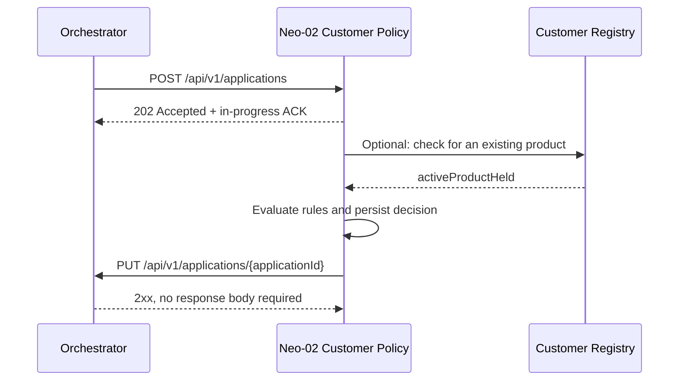

# Neo-02 Customer Policy — Orchestrator API Integration Guide

> Document status: As built (aligned with the current `neo-02` implementation)  
> Service ID: `neo02`  
> Protocol version: v1  
> Last verified: 2026-07-29

## 1. Purpose and scope

This document describes the HTTP integration contract between the Customer Policy module
(`neo-02`) and the Orchestrator. It is intended for the Orchestrator, Sidecar, and other
integration teams.

The core flow is asynchronous:

1. The Orchestrator submits a complete application to Neo-02.
2. Neo-02 immediately returns `202 Accepted`, indicating that the request was accepted but the
   decision is not yet complete.
3. Neo-02 evaluates the rules and persists the decision in the background.
4. Neo-02 reports the final status to the Orchestrator with `PUT`.



## 2. Environments and addresses

### 2.1 Neo-02 address

The Orchestrator calls Neo-02 at:

```text
{NEO02_BASE_URL}/api/v1/applications
```

The default local module address is:

```text
http://localhost:8080
```

Typical base URLs are:

| Environment | Base URL |
|---|---|
| Local host | `http://localhost:8080` |
| Standalone Docker Compose network | `http://backend:8080` |
| Full-system Docker network | `http://neo-02:8080` |
| Deployed through the ALB | `http://{ALB_HOST}/neo-02` |

### 2.2 Orchestrator address

Neo-02 configures its Orchestrator connection through environment variables:

| Environment variable | Default | Example |
|---|---|---|
| `ORCHESTRATOR_URL` | `http://localhost:9000` | Local Sidecar: `http://sidecar:8080`; system environment: `http://orchestrator:8080` |
| `SERVICE_ID` | `neo02` | Must match the step/service ID for which the Orchestrator is waiting |

In this document, `{ORCHESTRATOR_URL}` does not include `/api/v1/applications`.

## 3. Endpoint summary

| Direction | Method | Path | Purpose | Stability |
|---|---|---|---|---|
| Orchestrator → Neo-02 | `POST` | `/api/v1/applications` | Submit an application and start the asynchronous decision | Fixed core contract |
| Neo-02 → Orchestrator | `PUT` | `/api/v1/applications/{applicationId}` | Report a machine or human decision | Fixed core contract |
| Neo-02 → Orchestrator | `GET` | `/api/v1/applications/{applicationId}` | Fetch applicant details live | Extension; response shape still needs alignment |
| Neo-02 → Orchestrator | `GET` | `/api/v1/applications?name={name}` | Find application IDs by applicant name | Extension |
| Neo-02 → Registry | `GET` | Configured by `REGISTRY_LOOKUP_URL` | Check whether the customer already holds an active product | Configurable dependency; no fixed path yet |

The current implementation does not send an Authorization header, API key, or custom signature
header. If an integration environment requires authentication, both parties must first agree on
and add a shared contract.

## 4. Submit an application: Orchestrator → Neo-02

### 4.1 Request

```http
POST {NEO02_BASE_URL}/api/v1/applications
Content-Type: application/json
```

Complete example:

```json
{
  "applicationId": "APP-20260729-0001",
  "correlationId": "journey-7d56b2c8-a6a4-4cb8-8811-7ebd11847abd",
  "command": "process-application",
  "application": {
    "applicationId": "APP-20260729-0001",
    "channel": "MOBILE_APP",
    "submittedAt": "2026-07-29T09:14:00Z",
    "applicant": {
      "fullName": "Maria Nowak",
      "dateOfBirth": "1990-03-12",
      "email": "maria.nowak@example.com",
      "mobile": "+447700900001",
      "nationality": "PL",
      "countryOfResidence": "GB",
      "taxResidencies": ["GB"],
      "residentialStatus": "RENTING",
      "currentAddress": {
        "line1": "1 High Street",
        "line2": null,
        "city": "London",
        "postcode": "SW1A 1AA",
        "country": "GB"
      },
      "monthsAtAddress": 24,
      "dependants": 1
    },
    "identityDocument": {
      "type": "PASSPORT",
      "documentId": "P1234567",
      "issuingCountry": "PL",
      "expiryDate": "2030-12-31"
    },
    "employment": {
      "status": "PERMANENT",
      "employerName": "Example Ltd",
      "monthsInEmployment": 36
    },
    "finances": {
      "annualIncome": 52000,
      "monthlyHousingCost": 1200,
      "existingCreditCommitments": 300
    },
    "product": {
      "productCode": "CREDIT_CARD_REWARDS",
      "requestedCreditLimit": 3000
    },
    "delivery": {
      "useCurrentAddress": true,
      "address": null
    },
    "consents": {
      "termsAccepted": true,
      "paperlessStatements": true,
      "marketingConsent": false
    }
  }
}
```

### 4.2 Envelope fields

| Field | Type | Required | Constraints and description |
|---|---|---|---|
| `applicationId` | string | Yes | 1–64 characters; business key for the complete flow; used in the callback URL |
| `correlationId` | string | No | Correlates the journey across modules; currently used only for logging and is not returned in the callback |
| `command` | string | Yes | Must not be blank; for example, `process-application` |
| `application` | object | No | Complete customer application; missing fields are handled by business rules and do not necessarily produce HTTP `400` |

If the envelope `applicationId` and `application.applicationId` differ, the top-level envelope
value takes precedence.

### 4.3 Application fields

| Object | Fields |
|---|---|
| Root | `applicationId: string`, `channel: string`, `submittedAt: string` |
| `applicant` | `fullName: string`, `dateOfBirth: string`, `email: string`, `mobile: string`, `nationality: string`, `countryOfResidence: string`, `taxResidencies: string[]`, `residentialStatus: string`, `currentAddress: Address`, `monthsAtAddress: integer`, `dependants: integer` |
| `Address` | `line1: string`, `line2: string|null`, `city: string`, `postcode: string`, `country: string` |
| `identityDocument` | `type: string`, `documentId: string`, `issuingCountry: string`, `expiryDate: string` |
| `employment` | `status: string`, `employerName: string`, `monthsInEmployment: integer` |
| `finances` | `annualIncome: integer`, `monthlyHousingCost: integer`, `existingCreditCommitments: integer` |
| `product` | `productCode: string`, `requestedCreditLimit: integer` |
| `delivery` | `useCurrentAddress: boolean`, `address: Address|null` |
| `consents` | `termsAccepted: boolean`, `paperlessStatements: boolean`, `marketingConsent: boolean` |

Compatibility rules:

- Date fields must be transported as JSON strings. Invalid formats are still accepted at the HTTP
  boundary and are evaluated by the business rules.
- Business code fields are strings rather than transport-layer enums. Unknown values are not
  rejected during deserialization.
- Integer and boolean fields may be `null`, allowing the service to distinguish zero/false from
  not provided.
- Unknown new fields are ignored, allowing the Orchestrator to extend the payload compatibly.

### 4.4 Success response: 202 Accepted

Neo-02 only acknowledges that it has accepted the request. This response is not the final
decision.

```http
HTTP/1.1 202 Accepted
Content-Type: application/json
```

```json
{
  "status": "in-progress",
  "applicationId": "APP-20260729-0001",
  "serviceId": "neo02",
  "command": "process-application"
}
```

| Field | Value |
|---|---|
| `status` | Always lowercase `in-progress` |
| `applicationId` | The top-level application ID, returned unchanged |
| `serviceId` | `neo02` |
| `command` | The request command, returned unchanged |

### 4.5 Request errors

The following cases return `400 Bad Request` and do not start a decision:

- A missing or blank `applicationId`
- An `applicationId` longer than 64 characters
- A missing or blank `command`
- Invalid JSON or a JSON field with an incompatible type

Example error:

```json
{
  "timestamp": "2026-07-29T09:15:01Z",
  "status": 400,
  "error": "Bad Request",
  "message": "applicationId must not be blank",
  "errors": [
    {
      "field": "applicationId",
      "message": "must not be blank"
    }
  ]
}
```

`errors` is present only for field-validation failures. JSON parsing errors do not include it.

## 5. Decision callback: Neo-02 → Orchestrator

### 5.1 When it is sent

Neo-02 sends the callback after completing these steps in order:

1. Evaluate the business rules.
2. Commit the decision and rule results to Neo-02's own database.
3. Call the Orchestrator after the database commit succeeds.

The decision is therefore already persisted when the Orchestrator receives the callback.

### 5.2 Request

```http
PUT {ORCHESTRATOR_URL}/api/v1/applications/{applicationId}
Content-Type: application/json
```

```json
{
  "serviceId": "neo02",
  "status": "ACCEPTED",
  "comment": "POL_ALL_CHECKS_PASSED"
}
```

The callback body must contain exactly these three fields:

| Field | Type | Required | Description |
|---|---|---|---|
| `serviceId` | string | Yes | Fixed/configured as `neo02`; the Orchestrator uses it to match the waiting step |
| `status` | string | Yes | `ACCEPTED`, `REJECTED`, or `REFERRED`; must be uppercase |
| `comment` | string | Yes | Reason codes that produced this decision; multiple codes are joined with `, ` |

`applicationId` appears only in the URL path and must not be repeated in the body.

### 5.3 Decision status mapping

| Neo-02 outcome | Callback `status` | Expected Orchestrator behavior |
|---|---|---|
| `APPROVED` | `ACCEPTED` | Complete the current step successfully and continue the journey |
| `REJECTED` | `REJECTED` | Reject the application and end it or enter the Orchestrator-defined rejection flow |
| `REFERRED` | `REFERRED` | Pause automated processing and wait for human review |

Do not send `completed`, `rejected`, `application-manual`, or `local-manual` from older documents
as the `status`. The current fixed wire contract accepts only the three uppercase values above.

### 5.4 Reason codes

Machine-decision reason codes that may currently appear in `comment` are:

| Code | Meaning |
|---|---|
| `POL_ALL_CHECKS_PASSED` | All policy checks passed |
| `POL_CUSTOMER_BLOCKED` | The applicant's name and date of birth matched the local policy restriction list |
| `POL_EXISTING_PRODUCT_HELD` | The customer already holds a conflicting active product |
| `POL_REGISTRY_UNAVAILABLE` | The Registry lookup failed |
| `POL_SAMPLED_FOR_REVIEW` | The application was sampled for human review |
| `POL_TAX_RESIDENCY_EXCLUDED` | The application includes an excluded tax residency |
| `POL_TAX_RESIDENCY_UNSUPPORTED` | The application includes an unsupported tax residency |

Example:

```json
{
  "serviceId": "neo02",
  "status": "REJECTED",
  "comment": "POL_TAX_RESIDENCY_EXCLUDED, POL_EXISTING_PRODUCT_HELD"
}
```

### 5.5 Human-decision callback

A human decision uses the same fixed `PUT` endpoint and does not change the JSON schema:

```json
{
  "serviceId": "neo02",
  "status": "ACCEPTED",
  "comment": "local-manual POL_MANUAL_APPROVED: verified by policy analyst"
}
```

or:

```json
{
  "serviceId": "neo02",
  "status": "REJECTED",
  "comment": "local-manual POL_MANUAL_DECLINED: customer evidence insufficient"
}
```

Here, `local-manual` is only a prefix in `comment`; it is not the callback `status`.

### 5.6 Orchestrator response requirements

Neo-02 does not read the response body. The Orchestrator only needs to return any successful `2xx`
status:

```http
HTTP/1.1 204 No Content
```

The Orchestrator should implement this `PUT` as an idempotent operation and identify the waiting
step by `(applicationId, serviceId)`.

### 5.7 Callback failure and replay

Current behavior:

- A network failure or non-`2xx` response is logged as a warning and does not roll back the
  persisted decision.
- Neo-02 currently has no separate callback retry queue and does not retry automatically in the
  same worker.
- The Orchestrator should use its own timeout/sweeper to mark a step whose result has not arrived.
- If the Orchestrator resends the same `POST /api/v1/applications`, Neo-02 does not re-evaluate the
  rules. If the decision is already complete, Neo-02 replays the stored callback.

Both parties must therefore handle idempotency on the assumption that messages may be delivered
more than once and the final `PUT` may be received one or more times.

## 6. Application details lookup: Neo-02 → Orchestrator

Neo-02's operator interface does not retain the complete application payload. It fetches applicant
details from the Orchestrator in real time.

```http
GET {ORCHESTRATOR_URL}/api/v1/applications/{applicationId}
Accept: application/json
```

The recommended common response is a direct Application object:

```json
{
  "applicationId": "APP-20260729-0001",
  "channel": "MOBILE_APP",
  "submittedAt": "2026-07-29T09:14:00Z",
  "applicant": {
    "fullName": "Maria Nowak",
    "dateOfBirth": "1990-03-12",
    "countryOfResidence": "GB",
    "taxResidencies": ["GB"]
  },
  "product": {
    "productCode": "CREDIT_CARD_REWARDS",
    "requestedCreditLimit": 3000
  }
}
```

Recommended error behavior:

| Scenario | HTTP status |
|---|---|
| Application found | `200` |
| Application ID does not exist | `404` |
| Orchestrator temporarily unavailable | `5xx` |

### Current integration blocker: inconsistent response envelopes

Neo-02 currently has two expectations for the same GET endpoint:

- The `/cases/{applicationId}/applicant` implementation expects the direct Application object
  shown above.
- The `/api/v1/cases/{id}/applicant` implementation expects `{ "application": { ... } }` and reads
  `application.applicant.fullName`.

The Orchestrator cannot satisfy both shapes with one fixed response. The teams must agree on and
standardize one shape before integration. The recommendation is the direct Application object,
with the second Neo-02 proxy implementation changed accordingly. This is not a final external
contract until that alignment is complete and should be treated as an integration risk.

## 7. Name search: Neo-02 → Orchestrator

```http
GET {ORCHESTRATOR_URL}/api/v1/applications?name={urlEncodedName}
Accept: application/json
```

Successful response:

```http
HTTP/1.1 200 OK
Content-Type: application/json
```

```json
{
  "applicationIds": [
    "APP-20260729-0001",
    "APP-20260728-0042"
  ]
}
```

When there are no matches:

```json
{
  "applicationIds": []
}
```

If the request fails, the response is empty, or the Orchestrator is unavailable, Neo-02 degrades
the result to an empty list.

## 8. Registry lookup

The Registry is not part of the fixed Orchestrator callback contract, although the integration
environment may host the endpoint on the Orchestrator.

Enable the HTTP Registry with:

```text
REGISTRY_MODE=http
REGISTRY_LOOKUP_URL=http://orchestrator:8080/.../{applicationId}?fullName={fullName}&dateOfBirth={dateOfBirth}
```

The URI template must include:

- `{applicationId}`
- `{fullName}`
- `{dateOfBirth}`

Minimum successful response:

```json
{
  "activeProductHeld": false
}
```

`activeProductHeld` must be a boolean and must not be missing or `null`. This repository does not
yet define an authoritative endpoint path, so the integrating party must provide the complete URI
template in configuration.

Neo-02 attempts the Registry lookup up to three times. If all three attempts fail, the machine rule
records `POL_REGISTRY_UNAVAILABLE` and the final outcome is `REFERRED`.

## 9. Idempotency, ordering, and consistency requirements

### 9.1 applicationId

- The top-level `applicationId` is the unique business key for persistence, deduplication, and the
  callback.
- Its maximum length is 64 characters.
- The Orchestrator must keep the same application ID when retrying the same journey step.

### 9.2 Duplicate submissions

When the same application ID is submitted more than once:

- Neo-02 still returns a `202` ACK every time.
- It does not re-run the policy rules or Registry lookup.
- If the decision is complete, Neo-02 replays the stored callback.

### 9.3 Callback ordering

- The machine-decision callback occurs after the database commit.
- A human-decision callback may follow a `REFERRED` callback.
- The Orchestrator should allow the same `(applicationId, serviceId)` to transition from `REFERRED`
  to `ACCEPTED` or `REJECTED`.
- A human action sends a new callback only when it actually changes the decision.

## 10. Integration examples

### 10.1 Submit an application

```bash
curl -i -X POST 'http://localhost:8080/api/v1/applications' \
  -H 'Content-Type: application/json' \
  -d '{
    "applicationId":"APP-INTEGRATION-001",
    "correlationId":"journey-integration-001",
    "command":"process-application",
    "application":{
      "channel":"WEB",
      "applicant":{
        "fullName":"Maria Nowak",
        "dateOfBirth":"1990-03-12",
        "countryOfResidence":"GB",
        "taxResidencies":["GB"]
      },
      "product":{
        "productCode":"CREDIT_CARD_REWARDS",
        "requestedCreditLimit":3000
      }
    }
  }'
```

Expect an immediate `202`. The final result arrives asynchronously at the Orchestrator's `PUT`
endpoint.

### 10.2 Simulate a Neo-02 callback

```bash
curl -i -X PUT \
  'http://localhost:9000/api/v1/applications/APP-INTEGRATION-001' \
  -H 'Content-Type: application/json' \
  -d '{
    "serviceId":"neo02",
    "status":"ACCEPTED",
    "comment":"POL_ALL_CHECKS_PASSED"
  }'
```

## 11. Orchestrator implementation checklist

- [ ] Can send `Content-Type: application/json` to Neo-02 at `POST /api/v1/applications`.
- [ ] Treats `202 in-progress` as an acknowledgement, not the final result.
- [ ] Provides `PUT /api/v1/applications/{applicationId}` and accepts exactly the three fixed body
      fields.
- [ ] Accepts uppercase callback statuses `ACCEPTED`, `REJECTED`, and `REFERRED`.
- [ ] Does not require `applicationId` or `correlationId` in the callback body.
- [ ] Handles duplicate callbacks idempotently.
- [ ] Accepts a human-decision update from `REFERRED` to `ACCEPTED` or `REJECTED`.
- [ ] Returns `2xx` for a successful callback; the response body may be empty.
- [ ] Provides callback timeout/sweeper handling because Neo-02 has no separate retry queue.
- [ ] Aligns the application-details GET response envelope with Neo-02.
- [ ] Returns `{ "applicationIds": [...] }` if name search is enabled.
- [ ] Establishes the authoritative `REGISTRY_LOOKUP_URL` path if it hosts the Registry.

## 12. Known contract differences

Some earlier use-case and design documents in this repository used:

```text
POST /callbacks
status = completed | rejected | application-manual | local-manual
```

That is not the wire contract executed by the current code. Current integrations must use:

```text
PUT /api/v1/applications/{applicationId}
status = ACCEPTED | REJECTED | REFERRED
body = { serviceId, status, comment }
```

The human origin and reason code belong in `comment`; they must not change the fixed `status` enum.
