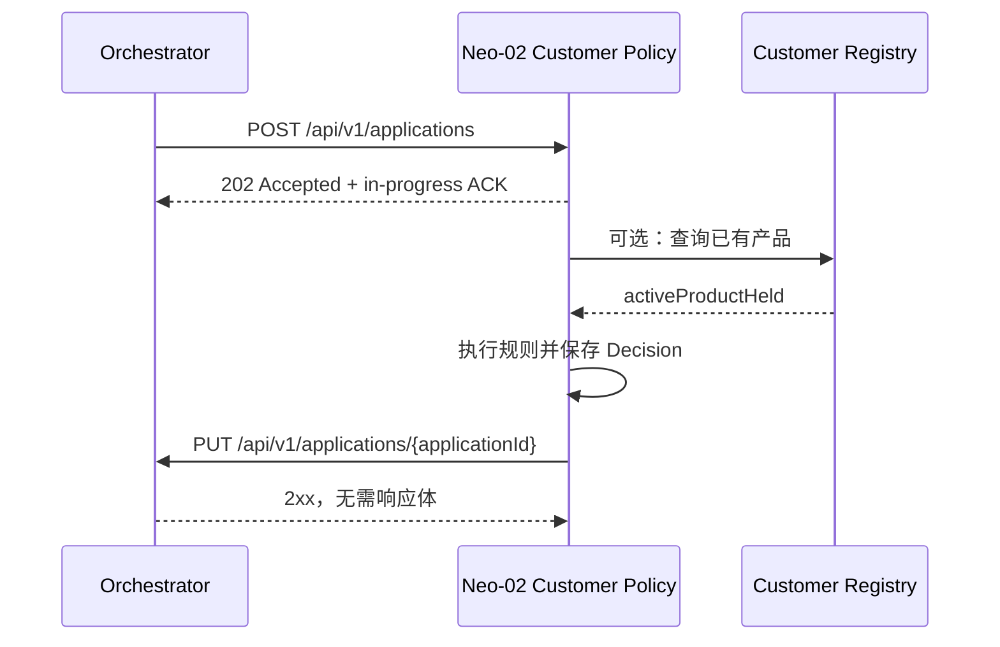

# Neo-02 Customer Policy — Orchestrator API 集成文档

> 文档状态：As-built（以当前 `neo-02` 代码为准）  
> 服务 ID：`neo02`  
> 协议版本：v1  
> 最后核对日期：2026-07-29

## 1. 目的与边界

本文档描述 Customer Policy 模块（`neo-02`）与 Orchestrator 的 HTTP 集成协议，供 Orchestrator、Sidecar 和其他集成团队联调使用。

核心处理采用异步模式：

1. Orchestrator 向 Neo-02 提交完整申请。
2. Neo-02 立即返回 `202 Accepted`，表示已接收但尚未完成 Decision。
3. Neo-02 在后台执行规则、持久化 Decision。
4. Neo-02 使用 `PUT` 将最终状态回传给 Orchestrator。



## 2. 环境与地址

### 2.1 Neo-02 地址

Orchestrator 调用 Neo-02 时使用：

```text
{NEO02_BASE_URL}/api/v1/applications
```

本地默认模块地址：

```text
http://localhost:8080
```

### 2.2 Orchestrator 地址

Neo-02 通过环境变量配置 Orchestrator：

| 环境变量 | 默认值 | 示例 |
|---|---|---|
| `ORCHESTRATOR_URL` | `http://localhost:9000` | 本地 Sidecar：`http://sidecar:8080`；系统环境：`http://orchestrator:8080` |
| `SERVICE_ID` | `neo02` | 必须与 Orchestrator 中等待的 step/service ID 一致 |

本文档中的 `{ORCHESTRATOR_URL}` 不包含 `/api/v1/applications`。

## 3. 接口总览

| 方向 | Method | Path | 用途 | 稳定性 |
|---|---|---|---|---|
| Orchestrator → Neo-02 | `POST` | `/api/v1/applications` | 提交申请，启动异步 Decision | 固定核心协议 |
| Neo-02 → Orchestrator | `PUT` | `/api/v1/applications/{applicationId}` | 回传机器或人工 Decision | 固定核心协议 |
| Neo-02 → Orchestrator | `GET` | `/api/v1/applications/{applicationId}` | 实时读取申请人资料 | 扩展接口，响应格式待统一 |
| Neo-02 → Orchestrator | `GET` | `/api/v1/applications?name={name}` | 按申请人姓名查询 application ID | 扩展接口 |
| Neo-02 → Registry | `GET` | 由 `REGISTRY_LOOKUP_URL` 指定 | 查询客户是否已有有效产品 | 可配置依赖，尚无固定路径 |

当前代码未发送 Authorization、API Key 或自定义签名 Header。如果集成环境要求鉴权，需要双方先补充统一协议。

## 4. 提交申请：Orchestrator → Neo-02

### 4.1 Request

```http
POST {NEO02_BASE_URL}/api/v1/applications
Content-Type: application/json
```

完整示例：

```json
{
  "applicationId": "APP-20260729-0001",
  "correlationId": "journey-7d56b2c8-a6a4-4cb8-8811-7ebd11847abd",
  "command": "process-application",
  "application": {
    "applicationId": "APP-20260729-0001",
    "channel": "MOBILE_APP",
    "submittedAt": "2026-07-29T09:14:00Z",
    "applicant": {
      "fullName": "Maria Nowak",
      "dateOfBirth": "1990-03-12",
      "email": "maria.nowak@example.com",
      "mobile": "+447700900001",
      "nationality": "PL",
      "countryOfResidence": "GB",
      "taxResidencies": ["GB"],
      "residentialStatus": "RENTING",
      "currentAddress": {
        "line1": "1 High Street",
        "line2": null,
        "city": "London",
        "postcode": "SW1A 1AA",
        "country": "GB"
      },
      "monthsAtAddress": 24,
      "dependants": 1
    },
    "identityDocument": {
      "type": "PASSPORT",
      "documentId": "P1234567",
      "issuingCountry": "PL",
      "expiryDate": "2030-12-31"
    },
    "employment": {
      "status": "PERMANENT",
      "employerName": "Example Ltd",
      "monthsInEmployment": 36
    },
    "finances": {
      "annualIncome": 52000,
      "monthlyHousingCost": 1200,
      "existingCreditCommitments": 300
    },
    "product": {
      "productCode": "CREDIT_CARD_REWARDS",
      "requestedCreditLimit": 3000
    },
    "delivery": {
      "useCurrentAddress": true,
      "address": null
    },
    "consents": {
      "termsAccepted": true,
      "paperlessStatements": true,
      "marketingConsent": false
    }
  }
}
```

### 4.2 Envelope 字段

| 字段 | 类型 | 必填 | 约束/说明 |
|---|---|---|---|
| `applicationId` | string | 是 | 1–64 个字符；整个流程的业务主键；回调 URL 使用该值 |
| `correlationId` | string | 否 | 跨模块 Journey 关联 ID；当前仅用于日志，不会随回调返回 |
| `command` | string | 是 | 非空，例如 `process-application` |
| `application` | object | 否 | 完整客户申请；缺失字段由业务规则处理，不一定导致 HTTP `400` |

如果 envelope 的 `applicationId` 与 `application.applicationId` 不一致，以 envelope 顶层的 `applicationId` 为准。

### 4.3 Application 字段

| 对象 | 字段 |
|---|---|
| 根对象 | `applicationId: string`、`channel: string`、`submittedAt: string` |
| `applicant` | `fullName: string`、`dateOfBirth: string`、`email: string`、`mobile: string`、`nationality: string`、`countryOfResidence: string`、`taxResidencies: string[]`、`residentialStatus: string`、`currentAddress: Address`、`monthsAtAddress: integer`、`dependants: integer` |
| `Address` | `line1: string`、`line2: string|null`、`city: string`、`postcode: string`、`country: string` |
| `identityDocument` | `type: string`、`documentId: string`、`issuingCountry: string`、`expiryDate: string` |
| `employment` | `status: string`、`employerName: string`、`monthsInEmployment: integer` |
| `finances` | `annualIncome: integer`、`monthlyHousingCost: integer`、`existingCreditCommitments: integer` |
| `product` | `productCode: string`、`requestedCreditLimit: integer` |
| `delivery` | `useCurrentAddress: boolean`、`address: Address|null` |
| `consents` | `termsAccepted: boolean`、`paperlessStatements: boolean`、`marketingConsent: boolean` |

兼容性规则：

- 日期字段必须用 JSON string 传输。格式错误也会先被接收，再由业务规则给出 Decision。
- 业务代码字段使用 string，不使用传输层 enum；未知值不会在反序列化阶段被拒绝。
- integer 和 boolean 字段允许 `null`，以区分“值为 0/false”和“未提供”。
- 未识别的新增字段会被忽略，允许 Orchestrator 向后兼容地扩展 payload。

### 4.4 成功响应：202 Accepted

Neo-02 只确认请求已接收。此响应不是最终 Decision。

```http
HTTP/1.1 202 Accepted
Content-Type: application/json
```

```json
{
  "status": "in-progress",
  "applicationId": "APP-20260729-0001",
  "serviceId": "neo02",
  "command": "process-application"
}
```

| 字段 | 值 |
|---|---|
| `status` | 固定为小写 `in-progress` |
| `applicationId` | 原样返回顶层申请 ID |
| `serviceId` | `neo02` |
| `command` | 原样返回请求 command |

### 4.5 请求错误

以下情况返回 `400 Bad Request`，且不会启动 Decision：

- 缺少或传入空白 `applicationId`
- `applicationId` 超过 64 个字符
- 缺少或传入空白 `command`
- JSON 无法解析或字段 JSON 类型错误

错误示例：

```json
{
  "timestamp": "2026-07-29T09:15:01Z",
  "status": 400,
  "error": "Bad Request",
  "message": "applicationId must not be blank",
  "errors": [
    {
      "field": "applicationId",
      "message": "must not be blank"
    }
  ]
}
```

`errors` 只在字段校验失败时存在；JSON 解析错误没有该字段。

## 5. Decision 回调：Neo-02 → Orchestrator

### 5.1 触发时机

Neo-02 在以下顺序完成后发送回调：

1. 执行业务规则；
2. 将 Decision 和 rule results 提交到 Neo-02 自己的数据库；
3. 数据库提交成功后，调用 Orchestrator。

因此，Orchestrator 收到回调时，Neo-02 的 Decision 已经持久化。

### 5.2 Request

```http
PUT {ORCHESTRATOR_URL}/api/v1/applications/{applicationId}
Content-Type: application/json
```

```json
{
  "serviceId": "neo02",
  "status": "ACCEPTED",
  "comment": "POL_ALL_CHECKS_PASSED"
}
```

回调 body 必须恰好使用以下三个字段：

| 字段 | 类型 | 必填 | 说明 |
|---|---|---|---|
| `serviceId` | string | 是 | 固定/配置为 `neo02`；Orchestrator 用它匹配等待中的 step |
| `status` | string | 是 | `ACCEPTED`、`REJECTED` 或 `REFERRED`，必须大写 |
| `comment` | string | 是 | 触发本次 Decision 的 reason code；多个 code 以 `, ` 连接 |

`applicationId` 只存在于 URL path，不得再次放入 body。

### 5.3 Decision 状态映射

| Neo-02 outcome | 回调 `status` | Orchestrator 预期行为 |
|---|---|---|
| `APPROVED` | `ACCEPTED` | 当前 step 成功，可继续 Journey |
| `REJECTED` | `REJECTED` | 拒绝申请，结束/转入 Orchestrator 定义的拒绝流程 |
| `REFERRED` | `REFERRED` | 暂停自动流程，等待人工处理 |

不要发送旧文档中出现的 `completed`、`rejected`、`application-manual` 或 `local-manual` 作为 `status`。当前固定 wire contract 只接受三个大写状态。

### 5.4 Reason codes

当前可能出现在 `comment` 中的机器 Decision reason code：

| Code | 含义 |
|---|---|
| `POL_ALL_CHECKS_PASSED` | 所有 policy checks 通过 |
| `POL_CUSTOMER_BLOCKED` | 申请人姓名和出生日期命中本地 policy restriction list |
| `POL_EXISTING_PRODUCT_HELD` | 客户已有冲突的有效产品 |
| `POL_REGISTRY_UNAVAILABLE` | Registry 查询失败 |
| `POL_SAMPLED_FOR_REVIEW` | 抽样进入人工复核 |
| `POL_TAX_RESIDENCY_EXCLUDED` | 命中排除的税务居民地区 |
| `POL_TAX_RESIDENCY_UNSUPPORTED` | 税务居民地区不受支持 |

示例：

```json
{
  "serviceId": "neo02",
  "status": "REJECTED",
  "comment": "POL_TAX_RESIDENCY_EXCLUDED, POL_EXISTING_PRODUCT_HELD"
}
```

### 5.5 人工 Decision 回调

人工审批仍使用同一个固定 `PUT` 接口，不改变 JSON schema：

```json
{
  "serviceId": "neo02",
  "status": "ACCEPTED",
  "comment": "local-manual POL_MANUAL_APPROVED: verified by policy analyst"
}
```

或：

```json
{
  "serviceId": "neo02",
  "status": "REJECTED",
  "comment": "local-manual POL_MANUAL_DECLINED: customer evidence insufficient"
}
```

这里的 `local-manual` 只是 `comment` 的前缀，不是 callback `status`。

### 5.6 Orchestrator 响应要求

Neo-02 不读取响应 body，只要求 Orchestrator 返回任意成功的 `2xx` 状态：

```http
HTTP/1.1 204 No Content
```

建议 Orchestrator 将该 `PUT` 实现为幂等操作，以 `(applicationId, serviceId)` 定位等待中的 step。

### 5.7 回调失败与重放

当前实现的行为：

- 网络异常或非 `2xx` 响应只记录 warning，不回滚已经保存的 Decision。
- 当前 Neo-02 没有独立的 callback retry queue，也不会在同一 worker 中自动重试。
- Orchestrator 应使用自己的 timeout/sweeper 标记长时间未收到结果的 step。
- 如果 Orchestrator 重发相同的 `POST /api/v1/applications`，Neo-02 不会重复运行规则；若已有 Decision，会重放已保存的回调。

因此，双方都必须按“可能重复投递、最终一次或多次 PUT”的方式实现幂等处理。

## 6. 申请详情查询：Neo-02 → Orchestrator

Neo-02 的操作员页面不会长期保存完整申请资料，需要向 Orchestrator 实时读取。

```http
GET {ORCHESTRATOR_URL}/api/v1/applications/{applicationId}
Accept: application/json
```

建议统一响应为直接的 Application 对象：

```json
{
  "applicationId": "APP-20260729-0001",
  "channel": "MOBILE_APP",
  "submittedAt": "2026-07-29T09:14:00Z",
  "applicant": {
    "fullName": "Maria Nowak",
    "dateOfBirth": "1990-03-12",
    "countryOfResidence": "GB",
    "taxResidencies": ["GB"]
  },
  "product": {
    "productCode": "CREDIT_CARD_REWARDS",
    "requestedCreditLimit": 3000
  }
}
```

建议错误行为：

| 场景 | HTTP 状态 |
|---|---|
| 找到申请 | `200` |
| application ID 不存在 | `404` |
| Orchestrator 暂时不可用 | `5xx` |

### 当前集成阻塞项：响应 envelope 不一致

当前 Neo-02 对同一个 GET endpoint 存在两种期待：

- `/cases/{applicationId}/applicant` 的实现期待上面所示的直接 Application 对象。
- `/api/v1/cases/{id}/applicant` 的实现期待 `{ "application": { ... } }`，并从 `application.applicant.fullName` 取值。

Orchestrator 无法用一个固定响应同时满足两种结构。联调前必须在双方确认后统一；建议统一为“直接 Application 对象”，并修改第二个 Neo-02 proxy 实现。该项不是本文档对外承诺的最终协议，统一完成前应视为阻塞风险。

## 7. 姓名搜索：Neo-02 → Orchestrator

```http
GET {ORCHESTRATOR_URL}/api/v1/applications?name={urlEncodedName}
Accept: application/json
```

成功响应：

```http
HTTP/1.1 200 OK
Content-Type: application/json
```

```json
{
  "applicationIds": [
    "APP-20260729-0001",
    "APP-20260728-0042"
  ]
}
```

没有匹配时返回：

```json
{
  "applicationIds": []
}
```

Neo-02 在请求失败、响应为空或 Orchestrator 不可用时将结果降级为空数组。

## 8. Registry 查询

Registry 不属于固定 Orchestrator callback contract，但集成环境可能由 Orchestrator 承载该接口。

启用 HTTP Registry：

```text
REGISTRY_MODE=http
REGISTRY_LOOKUP_URL=http://orchestrator:8080/.../{applicationId}?fullName={fullName}&dateOfBirth={dateOfBirth}
```

URI template 必须包含：

- `{applicationId}`
- `{fullName}`
- `{dateOfBirth}`

最小成功响应：

```json
{
  "activeProductHeld": false
}
```

`activeProductHeld` 必须是 boolean 且不能缺失/null。当前仓库尚未定义权威 endpoint path，集成方需要在配置时提供完整 URI template。

Neo-02 对 Registry 查询最多尝试 3 次；3 次均失败时，机器规则记录 `POL_REGISTRY_UNAVAILABLE`，最终 outcome 为 `REFERRED`。

## 9. 幂等、顺序与一致性要求

### 9.1 applicationId

- 顶层 `applicationId` 是所有持久化、去重和 callback 的唯一业务键。
- 长度最多 64 个字符。
- Orchestrator 在同一 Journey step 的重试中必须保持相同 application ID。

### 9.2 重复提交

相同 application ID 重复提交时：

- Neo-02 每次仍返回 `202` ACK。
- 不重新运行 Policy rules 或 Registry lookup。
- 如果 Decision 已完成，Neo-02 会重放存储的 callback。

### 9.3 回调顺序

- 机器 Decision callback 发生在数据库提交后。
- `REFERRED` 后可能产生人工 Decision callback。
- Orchestrator 应允许同一个 `(applicationId, serviceId)` 从 `REFERRED` 更新为 `ACCEPTED` 或 `REJECTED`。
- 人工操作只有实际改变 Decision 时才发送新 callback。

## 10. 联调示例

### 10.1 提交申请

```bash
curl -i -X POST 'http://localhost:8080/api/v1/applications' \
  -H 'Content-Type: application/json' \
  -d '{
    "applicationId":"APP-INTEGRATION-001",
    "correlationId":"journey-integration-001",
    "command":"process-application",
    "application":{
      "channel":"WEB",
      "applicant":{
        "fullName":"Maria Nowak",
        "dateOfBirth":"1990-03-12",
        "countryOfResidence":"GB",
        "taxResidencies":["GB"]
      },
      "product":{
        "productCode":"CREDIT_CARD_REWARDS",
        "requestedCreditLimit":3000
      }
    }
  }'
```

预期立即获得 `202`；最终结果通过 Orchestrator 的 PUT endpoint 异步到达。

### 10.2 模拟 Neo-02 callback

```bash
curl -i -X PUT \
  'http://localhost:9000/api/v1/applications/APP-INTEGRATION-001' \
  -H 'Content-Type: application/json' \
  -d '{
    "serviceId":"neo02",
    "status":"ACCEPTED",
    "comment":"POL_ALL_CHECKS_PASSED"
  }'
```

## 11. Orchestrator 实现检查清单

- [ ] 可以向 Neo-02 `POST /api/v1/applications` 发送 `Content-Type: application/json`。
- [ ] 将 `202 in-progress` 视为接收确认，而不是最终结果。
- [ ] 提供 `PUT /api/v1/applications/{applicationId}`，接受固定三个字段。
- [ ] callback `status` 接受大写 `ACCEPTED`、`REJECTED`、`REFERRED`。
- [ ] 不要求 callback body 包含 `applicationId` 或 `correlationId`。
- [ ] 对重复 callback 幂等。
- [ ] 接受 `REFERRED → ACCEPTED/REJECTED` 的人工 Decision 更新。
- [ ] callback 成功时返回 `2xx`；响应 body 可以为空。
- [ ] 提供 callback timeout/sweeper，因为 Neo-02 当前没有独立 retry queue。
- [ ] 与 Neo-02 统一 application details GET 的响应 envelope。
- [ ] 如启用姓名搜索，按 `{ "applicationIds": [...] }` 返回。
- [ ] 如承载 Registry，确定并配置 `REGISTRY_LOOKUP_URL` 的权威路径。

## 12. 已知协议差异

仓库内部分早期 UC/设计文档使用过：

```text
POST /callbacks
status = completed | rejected | application-manual | local-manual
```

这不是当前代码执行的 wire contract。当前集成必须使用：

```text
PUT /api/v1/applications/{applicationId}
status = ACCEPTED | REJECTED | REFERRED
body = { serviceId, status, comment }
```

人工来源和 reason code 放在 `comment`，不能改变固定的 `status` 枚举。
