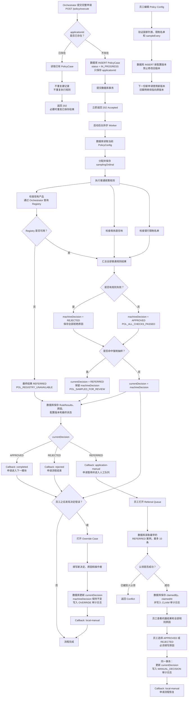

# Customer Policy 后端流程图（Mermaid）

```mermaid
flowchart TD
    A["Orchestrator 提交完整申请<br/>POST /policy/execute"] --> B{"applicationId<br/>是否已存在？"}

    B -->|"已存在"| C["读取已有 PolicyCase"]
    C --> D["不重复建记录<br/>不重复执行规则"]
    D --> E["返回 202<br/>必要时重发已保存结果"]

    B -->|"不存在"| F["数据库 INSERT PolicyCase<br/>status = IN_PROGRESS<br/>只保存 applicationId"]
    F --> G["提交数据库事务"]
    G --> H["立即返回 202 Accepted"]
    H --> I["启动后台异步 Worker"]

    I --> J["数据库读取当前 PolicyConfig"]
    J --> K["分配并保存 samplingOrdinal"]
    K --> L["执行普通政策规则"]

    L --> M["检查现有产品<br/>通过 Orchestrator 查询 Registry"]
    L --> N["检查税务居住地"]
    L --> O["检查银行限制名单"]

    M --> P{"Registry 是否可用？"}
    P -->|"否"| Q["最终结果 REFERRED<br/>POL_REGISTRY_UNAVAILABLE"]
    P -->|"是"| R["汇总全部普通规则结果"]
    N --> R
    O --> R

    R --> S{"是否有规则失败？"}
    S -->|"是"| T["machineDecision = REJECTED<br/>保存全部拒绝原因"]
    S -->|"否"| U["machineDecision = APPROVED<br/>POL_ALL_CHECKS_PASSED"]

    T --> V{"是否命中强制抽样？"}
    U --> V

    V -->|"是"| W["currentDecision = REFERRED<br/>保留 machineDecision<br/>POL_SAMPLED_FOR_REVIEW"]
    V -->|"否"| X["currentDecision = machineDecision"]

    Q --> Y["数据库保存 RuleResults、原因、<br/>配置版本和最终状态"]
    W --> Y
    X --> Y

    Y --> Z{"currentDecision"}

    Z -->|"APPROVED"| AA["Callback: completed<br/>申请进入下一模块"]
    Z -->|"REJECTED"| AB["Callback: rejected<br/>申请流程结束"]
    Z -->|"REFERRED"| AC["Callback: application-manual<br/>申请暂停并进入人工队列"]

    AC --> AD["员工打开 Referral Queue"]
    AD --> AE["数据库读取最早的<br/>REFERRED 案例，最多 10 条"]
    AE --> AF{"认领是否成功？"}

    AF -->|"已被别人认领"| AG["返回 Conflict"]
    AF -->|"成功"| AH["数据库保存 claimedBy、claimedAt<br/>并写入 CLAIM 审计日志"]

    AH --> AI["员工查看机器结果和全部规则原因"]
    AI --> AJ["员工选择 APPROVED 或 REJECTED<br/>必须填写原因"]

    AJ --> AK["同一事务：<br/>更新 currentDecision<br/>写入 MANUAL_DECISION 审计日志"]
    AK --> AL["Callback: local-manual<br/>申请流程恢复"]

    X --> AM{"员工之后发现决定错误？"}
    AA --> AM
    AB --> AM

    AM -->|"否"| AN["流程完成"]
    AM -->|"是"| AO["打开 Override Case"]
    AO --> AP["填写新决定、原因和操作者"]
    AP --> AQ["数据库更新 currentDecision<br/>machineDecision 保持不变<br/>写入 OVERRIDE 审计日志"]
    AQ --> AR["Callback: local-manual"]
    AR --> AN

    AS["员工编辑 Policy Config"] --> AT["验证国家列表、限制名单<br/>和 sampleEvery"]
    AT --> AU["数据库 INSERT 新配置版本<br/>禁止修改旧版本"]
    AU --> AV["下一份新申请使用新版本<br/>旧案例继续指向原版本"]
```
