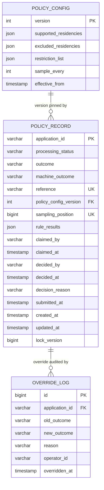
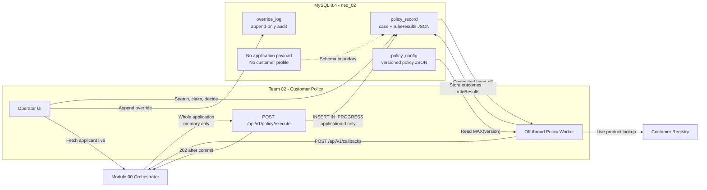

# Customer Policy Three-Table Schema Design

[中文版](./schema-design.zh-CN.md)

## 1. Decision

Team 02 will use the three-entity starting point from the Customer Policy v5
brief:

1. `policy_record` — one row per `applicationId`;
2. `policy_config` — one insert-only row per complete policy version;
3. `override_log` — one append-only row per manual override.

This design deliberately does not split residency lists, restriction entries,
rule results, sampling state, or general operator actions into separate tables.
The brief warns against beginning with an over-complicated model, and all locked
UC00-UC08 requirements can be satisfied by these three tables.

## 2. Source of Truth and Contract

The Team 02 Customer Policy v5 brief is the source of truth for this design:

- inbound: `POST /api/v1/policy/execute`;
- command: `check-policy`;
- envelope: `applicationId`, `correlationId`, `command`, the whole
  `application`, and the v5 `outputs` block;
- immediate acknowledgement: HTTP `202` with `status`, `applicationId`, and
  `command`;
- off-thread callback: `POST /api/v1/callbacks`;
- outcomes: `APPROVED`, `REJECTED`, and `REFERRED`.

Callback mapping:

| Situation | Outcome | Callback status | Journey effect |
|---|---|---|---|
| Automatic approval | `APPROVED` | `completed` | Continue to the next step |
| Automatic rejection | `REJECTED` | `rejected` | End the journey |
| Automatic referral | `REFERRED` | `application-manual` | Park for review |
| Queue decision or override | `APPROVED` or `REJECTED` | `local-manual` | Resume with the human outcome |

Only the orchestrator calls `/execute`. The full application is available to the
worker, but the application payload is never stored. Applicant detail is fetched
live through this module's orchestrator proxy.

The target database is MySQL 8.4. Liquibase owns the schema and Hibernate uses
`ddl-auto=validate`; migrations are append-only.

## 3. Why Three Tables Are Enough

| Use case | Storage needed | How the three-table model supports it |
|---|---|---|
| UC00 Process Application | `policy_record` | Insert one `IN_PROGRESS` row before returning `202`; unique `application_id` provides idempotency |
| UC01 Search Cases | `policy_record` | Search IDs locally; resolve names and hydrate applicant details live through the orchestrator; limit 10 |
| UC02 Review Decision | `policy_record` | Read `outcome`, `machine_outcome`, pinned config version, and `rule_results` |
| UC03 View Applicant | No applicant table | Proxy the orchestrator using `application_id`; store nothing locally |
| UC04 Referral Queue | `policy_record` | Use outcome, claim fields, human decision fields, and optimistic locking |
| UC05 Rejection Patterns | `policy_record` | Aggregate reason codes from `rule_results` JSON over `submitted_at` |
| UC06 Override Case | `policy_record` + `override_log` | Update current outcome and append the immutable before/after audit row |
| UC07 Edit Policy Config | `policy_config` | Insert a complete new version; never update an old one |
| UC08 Config History | `policy_config` | Read all versions; `MAX(version)` is current |

Candidate rules UC09 and UC10 can add fields inside the versioned config document
and new sections inside `rule_results` without creating a new table solely for
each rule.

### Small field-level additions to the suggested ER

The design keeps the brief's three entities but adds a few columns needed to make
its acceptance criteria enforceable:

| Addition | Justification |
|---|---|
| `processing_status` | UC00 requires a durable `IN_PROGRESS` state before the outcome exists |
| `sampling_position` | UC02 exposes the exact first-decision position and sampling must be idempotent |
| `created_at`, `updated_at` | Operational ordering and recovery cannot depend on applicant data |
| `lock_version` | UC04 requires a deterministic `409` when two operators claim the same case |
| `override_log.id` | Every append-only audit event needs a stable primary key |

These are columns on the three suggested entities, not additional domain tables.

## 4. Entity Relationship Diagram



## 5. Processing and Data Ownership



## 6. Table Definitions

### 6.1 `policy_record`

One durable row per orchestrator application. This is the case, queue item,
decision trace, and reporting source.

| Column | MySQL type | Null | Source | Constraint / meaning |
|---|---|---:|---|---|
| `application_id` | `VARCHAR(64)` | no | Orchestrator `/execute` envelope | Primary key; the only applicant-related identifier stored |
| `processing_status` | `VARCHAR(24)` | no | Customer Policy service workflow | `IN_PROGRESS` or `DECIDED`; starts as `IN_PROGRESS` |
| `outcome` | `VARCHAR(16)` | yes | Rule engine, queue reviewer, or override request | Current result: `APPROVED`, `REJECTED`, or `REFERRED` |
| `machine_outcome` | `VARCHAR(16)` | yes | Customer Policy rule engine | Result of rules 1-3 before sampling or human intervention; never overwritten |
| `reference` | `VARCHAR(32)` | no | Customer Policy service, generated before insert | Unique operator-facing reference |
| `policy_config_version` | `INT` | yes | Current `policy_config` selected by the worker | FK to the config used; null until the worker begins |
| `sampling_position` | `BIGINT` | yes | Customer Policy service sampling allocator | Unique first-decision position used by the every-X rule |
| `rule_results` | `JSON` | yes | Rule engine, derived from the in-memory application, policy config, and live registry result | Four embedded rule sections; null while processing |
| `claimed_by` | `VARCHAR(100)` | yes | Authenticated operator from the claim request | Operator currently holding the referred case |
| `claimed_at` | `TIMESTAMP(6)` | yes | Service/database clock when the claim succeeds | Claim time |
| `decided_by` | `VARCHAR(100)` | yes | Authenticated operator from the manual-decision or override request | Human decision maker; null when the machine result stands |
| `decided_at` | `TIMESTAMP(6)` | yes | Service/database clock when the human decision or override succeeds | Human decision or override time |
| `decision_reason` | `VARCHAR(1000)` | yes | Operator's manual-decision or override request | Mandatory reason for a human decision |
| `submitted_at` | `TIMESTAMP(6)` | no | Orchestrator `application.submittedAt` (brief-listed; see note below) | Submission timestamp used by search ordering and date-range reports |
| `created_at` | `TIMESTAMP(6)` | no | MySQL `CURRENT_TIMESTAMP(6)` default on intake insert | Local row creation time |
| `updated_at` | `TIMESTAMP(6)` | no | Customer Policy service/MySQL update timestamp | Latest case update |
| `lock_version` | `BIGINT` | no | JPA optimistic locking | Optimistic-lock version for claim/decision races |

`submitted_at` is the only field with an unresolved source-of-truth conflict:
the suggested ER and the queue/reporting use cases include it, while UC00 says
that only `applicationId` from the application payload is persisted. Until the
instructor confirms the intended interpretation, either omit `submitted_at` and
use local `created_at` for ordering/reporting, or obtain explicit approval to
persist `application.submittedAt`.

Constraints and indexes:

- primary key `application_id`;
- unique `reference`;
- unique `sampling_position`;
- FK `policy_config_version -> policy_config.version`, delete restricted;
- index `(processing_status, created_at)`;
- index `(outcome, submitted_at)`;
- index `(claimed_by, claimed_at)`;
- index `policy_config_version`.

`reference` must be generated before insert because there is no numeric
auto-increment case ID. A short random or ULID-derived value such as
`pol-01J2M8R4K9` avoids adding another sequence table. The unique constraint is
the collision backstop.

#### `rule_results` JSON shape

```json
{
  "existingProduct": {
    "passed": true,
    "registryChecked": true,
    "reasonCodes": []
  },
  "taxResidency": {
    "passed": true,
    "matchedList": "SUPPORTED",
    "reasonCodes": []
  },
  "restrictionList": {
    "passed": true,
    "reasonCodes": []
  },
  "sampling": {
    "sampled": false,
    "position": 20,
    "reasonCodes": []
  }
}
```

Rules for this document:

- all four locked sections are written together with the machine outcome;
- reason codes are arrays because one case may contribute several reasons;
- no applicant name, DOB, country list, registry payload, or other raw
  application value is stored;
- the sampling position must equal the relational `sampling_position`;
- manual decisions and overrides do not rewrite the machine rule results.

MySQL 8.4 `JSON_TABLE` can unnest every `reasonCodes` array for UC05. That query
must have a real-MySQL integration test because H2 compatibility mode does not
prove MySQL JSON query behaviour.

### 6.2 `policy_config`

One row is one complete policy document. The table is insert-only:
`MAX(version)` is current, and old rows remain available to explain old cases.

| Column | MySQL type | Null | Source | Constraint / meaning |
|---|---|---:|---|---|
| `version` | `INT` | no | Customer Policy service; version 1 is seeded by Liquibase | Primary key; next version is `MAX(version) + 1` |
| `supported_residencies` | `JSON` | no | Liquibase seed for version 1; compliance officer `POST /config` for later versions | JSON array of uppercase ISO alpha-2 country codes |
| `excluded_residencies` | `JSON` | no | Liquibase seed for version 1; compliance officer `POST /config` for later versions | JSON array of uppercase ISO alpha-2 country codes |
| `restriction_list` | `JSON` | no | Liquibase seed for version 1; compliance officer `POST /config` for later versions | Array of `{fullName, dateOfBirth, reason}` objects |
| `sample_every` | `INT` | no | Liquibase seed for version 1; compliance officer `POST /config` for later versions | Every Xth first-time decision is referred; must be at least 1 |
| `effective_from` | `TIMESTAMP(6)` | no | Service/database clock when the immutable config version is inserted | Time this version became current |

Example:

```json
{
  "version": 1,
  "supportedResidencies": ["GB", "IE", "PL", "DE", "FR", "ES", "NL"],
  "excludedResidencies": ["US"],
  "restrictionList": [
    {
      "fullName": "Victor Sable",
      "dateOfBirth": "1978-03-02",
      "reason": "prior fraud loss"
    },
    {
      "fullName": "Dana Kovacs",
      "dateOfBirth": "1984-11-19",
      "reason": "account abuse"
    }
  ],
  "sampleEvery": 7
}
```

Validation before insert:

- both residency values are JSON arrays;
- every country is uppercase ISO alpha-2;
- no country appears in both lists;
- every restriction entry has non-blank `fullName`, ISO date
  `dateOfBirth`, and non-blank `reason`;
- duplicate restriction entries are rejected using normalized name + DOB;
- `sample_every >= 1`;
- the submitted document is complete; missing lists are not inherited
  implicitly.

JSON is appropriate here because UC07 writes and UC08 reads the whole version as
one document. The brief does not require independent CRUD, joins, or reports over
individual residency or restriction rows. Versioning the complete document also
prevents a case from observing a mixture of old and new lists.

Publishing a version runs in one transaction, locks the current maximum version,
and inserts `MAX(version) + 1`. Existing versions are never updated or deleted.

### 6.3 `override_log`

Append-only audit trail for UC06. Queue decisions update the decision fields on
`policy_record`; this table is specifically for a later manual override.

| Column | MySQL type | Null | Source | Constraint / meaning |
|---|---|---:|---|---|
| `id` | `BIGINT` | no | MySQL auto-increment | Primary key |
| `application_id` | `VARCHAR(64)` | no | Override URL path and referenced `policy_record` | FK to `policy_record.application_id` |
| `old_outcome` | `VARCHAR(16)` | no | Current `policy_record.outcome`, read inside the override transaction | Outcome before the override |
| `new_outcome` | `VARCHAR(16)` | no | Operator's override request | `APPROVED`, `REJECTED`, or `REFERRED` |
| `reason` | `VARCHAR(1000)` | no | Operator's override request | Mandatory operator justification |
| `operator_id` | `VARCHAR(100)` | no | Authenticated operator; request field until authentication is integrated | Authenticated operator identity |
| `overridden_at` | `TIMESTAMP(6)` | no | Service/database clock when the override succeeds | Override time |

Constraints and indexes:

- FK to `policy_record`, delete restricted;
- index `(application_id, overridden_at)`;
- index `(operator_id, overridden_at)`.

An override transaction updates `policy_record.outcome`, decision metadata, and
inserts one `override_log` row. It never changes `machine_outcome`,
`policy_config_version`, `sampling_position`, or `rule_results`.

## 7. Sampling Without a Fourth Table

The brief requires every Xth first-time policy decision to be referred and exposes
the position in `ruleResults.sampling.position`.

The worker allocates `sampling_position` in a short transaction:

1. lock the current `policy_config` row with `SELECT ... FOR UPDATE`;
2. read `MAX(policy_record.sampling_position) + 1`;
3. set the case's config version and sampling position;
4. commit immediately;
5. perform registry and rule calls outside the lock.

The unique constraint on `sampling_position` is the final concurrency guard. This
keeps exact sampling inside `policy_record` rather than introducing a separate
counter entity. Allocation must be tested with concurrent workers on MySQL 8.4.

A case is sampled when:

```text
sampling_position % sample_every == 0
```

Sampling applies only once per new `application_id`; repeated `/execute` calls
never allocate another position.

## 8. Intake, Idempotency, and Callback Flow

Before returning `202`:

1. validate `applicationId` and `command = check-policy`;
2. insert one `policy_record` with `processing_status = IN_PROGRESS`;
3. on duplicate `application_id`, load the existing row instead;
4. commit;
5. return the locked acknowledgement body;
6. trigger processing only after commit.

The request thread never calls a provider or evaluates a policy rule. The
committed row is the durable hand-off. Recovery scans stranded `IN_PROGRESS` rows
and fetches the application live from the orchestrator; the payload remains
unstored.

The decision worker stores config version, position, rule results, outcomes, and
`processing_status = DECIDED` in one transaction, then sends the callback.

For repeated `/execute`:

- an `IN_PROGRESS` case is acknowledged but not started a second time;
- a decided case does not re-run rules or call the registry;
- its stored outcome is replayed with the callback status derived from outcome
  and human-decision metadata.

## 9. Manual Queue and Override Concurrency

Claim uses an optimistic update:

```text
UPDATE policy_record
SET claimed_by = ?, claimed_at = ?, lock_version = lock_version + 1
WHERE application_id = ?
  AND outcome = 'REFERRED'
  AND claimed_by IS NULL
  AND lock_version = ?
```

Zero updated rows returns HTTP `409`. Release requires the same operator.

A queue decision requires `APPROVED` or `REJECTED`, `operator`, and a non-blank
reason. It updates `outcome`, `decided_by`, `decided_at`, and `decision_reason`
without changing machine fields, then emits a `local-manual` callback.

An override uses the same optimistic-lock discipline and additionally appends an
`override_log` row.

## 10. Data Ownership and Privacy

Stored:

- `application_id`;
- case timing and workflow metadata;
- derived outcomes and rule reason codes;
- versioned bank-owned policy configuration;
- operator claim, decision, and override audit metadata.

Not stored:

- inbound request JSON;
- applicant name, DOB, address, email, phone, nationality, or tax-residency
  array from the application;
- customer-registry response payload;
- a local customer profile.

The restriction list contains bank-owned policy data, not copied applicant data.
Its access must still be limited to authorised staff. Free-text decision and
override reasons must instruct operators not to enter applicant PII.

## 11. Liquibase Plan

Never edit the applied `001-create-demo-showcase.yaml`.

Recommended append-only changesets:

1. `002-create-policy-config.yaml`
2. `003-create-policy-record.yaml`
3. `004-create-override-log.yaml`
4. `005-seed-policy-config-v1.yaml`
5. `006-drop-demo-showcase.yaml`

Add `006` only after no Java code, repository, endpoint, or test references
`DemoShowcase`.

## 12. Validation

Docker-free tests with H2:

- duplicate `/execute` creates one row;
- the row commits before `202`;
- config and rule validation;
- decision precedence and reason-code shape;
- claim/release conflict handling;
- manual decision and override audit behaviour.

MySQL 8.4 Testcontainers integration tests:

- Liquibase and `ddl-auto=validate`;
- JSON persistence and `JSON_TABLE` reason aggregation;
- config version allocation under concurrency;
- sampling-position allocation under concurrency;
- foreign keys, unique constraints, and timestamp precision.

This model intentionally accepts more complex JSON queries in exchange for a
smaller domain model that directly follows the brief. A fourth operational table,
such as a callback outbox, should be added only if durable callback-attempt
tracking becomes an agreed requirement.
