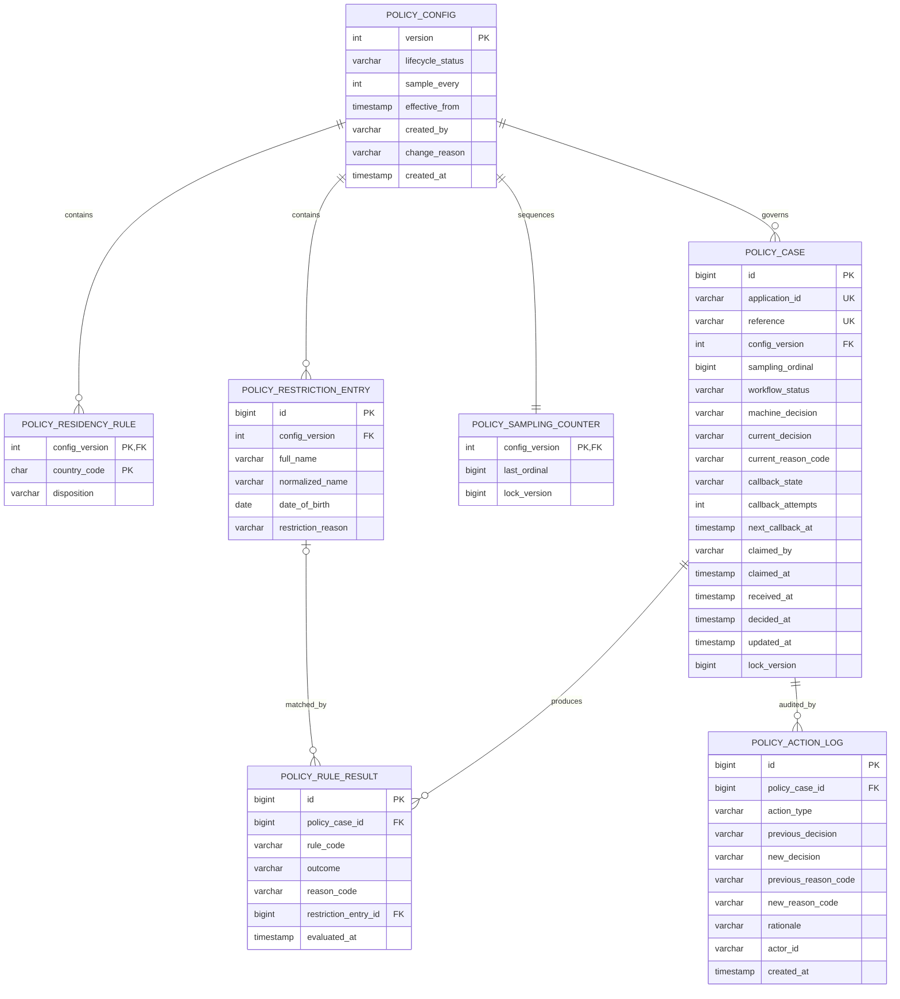

# Customer Policy Schema Design

## 1. Purpose

This document proposes the database schema for Team 02, Customer Policy. It is a
design and implementation guide only; it does not create migrations or change the
running application.

The design supports the following core capabilities:

- evaluate one customer-policy case per orchestrator application;
- check existing product ownership through the customer registry;
- evaluate tax residency policy;
- match against the bank-owned restriction list;
- refer sampled or indeterminate cases for manual review;
- record manual decisions and later overrides;
- edit versioned policy configuration and inspect its history;
- search cases and report rejection patterns;
- retry and observe callback delivery without changing the orchestrator contract.

## 2. Sources and Binding Constraints

This design is based on:

- the repository `AGENTS.md` and `README.md`;
- the current Java contract under
  `integrations/orchestrator`;
- the Team 02 Customer Policy v5 student brief;
- the capstone kickoff material.

Where the v5 brief conflicts with this repository, the repository contract wins:

- inbound: `POST /api/v1/applications`;
- immediate response: HTTP `202`;
- callback: `PUT /api/v1/applications/{applicationId}`;
- callback status: `ACCEPTED`, `REJECTED`, or `REFERRED`;
- callback service ID: `neo02`.

The database is MySQL 8.4. Liquibase owns the schema and Hibernate uses
`ddl-auto=validate`. Changesets must therefore be append-only.

The service must not persist the application payload or create a local customer
record. Applicant details shown to an operator must be fetched live from the
orchestrator by `application_id`.

## 3. Design Decisions

### 3.1 One case per application

`policy_case.application_id` is copied from the request envelope, not from the
nested application object. A unique constraint makes request handling idempotent:
re-delivery must load the existing case instead of creating a second decision.

### 3.2 Immutable configuration versions

Every evaluated case points to the exact configuration version used. A published
version is immutable. Editing policy creates a new version rather than modifying
the version attached to historical cases.

This allows the bank to answer: "What policy was in effect when this decision was
made?"

### 3.3 Normalize data that is filtered, joined, or aggregated

Residency rules, restriction entries, rule outcomes, and audit actions are stored
as rows. They are not JSON because the application needs to:

- enforce uniqueness and foreign keys;
- search individual values;
- aggregate rejection reasons;
- index restriction-list matching;
- retain a clear audit history.

JSON is not required in the core schema. If a future rule engine produces
diagnostic data that has no stable shape, a small JSON evidence snapshot may be
added later, but it must not contain the applicant payload or PII.

### 3.4 Do not use MySQL `ENUM`

Status and decision fields use `VARCHAR`. Java enums and service validation define
their allowed values. This avoids a database migration whenever a local workflow
state is added and keeps H2 tests compatible with MySQL.

### 3.5 Separate machine and human decisions

`machine_decision` preserves the rule engine's original result.
`current_decision` is the decision currently reported by the module. Manual review
or override may change `current_decision`, but must not overwrite
`machine_decision`.

### 3.6 Store rule facts, not applicant data

`policy_rule_result` records which rule ran, its outcome, and its reason code. It
does not store names, dates of birth, addresses, tax-residency arrays, registry
responses, or the inbound JSON.

For a restriction-list match, it may reference the bank-owned
`policy_restriction_entry`. That entry is policy configuration, not a copy of the
applicant.

## 4. Entity Relationship Diagram



## 5. Table Definitions

### 5.1 `policy_config`

One row represents one complete policy version.

| Column | MySQL type | Null | Constraint / meaning |
|---|---|---:|---|
| `version` | `INT` | no | Primary key; business version such as `1`, `2`, `3` |
| `lifecycle_status` | `VARCHAR(16)` | no | `DRAFT`, `PUBLISHED`, or `RETIRED` |
| `sample_every` | `INT` | no | Refer every Nth eligible case; must be greater than zero |
| `effective_from` | `TIMESTAMP(6)` | yes | Null for draft; required when published |
| `created_by` | `VARCHAR(100)` | no | Operator or system identity |
| `change_reason` | `VARCHAR(500)` | no | Required explanation for the new version |
| `created_at` | `TIMESTAMP(6)` | no | Defaults to `CURRENT_TIMESTAMP(6)` |

Recommended indexes:

- primary key on `version`;
- index on `(lifecycle_status, effective_from)`.

Rules:

- only one published version may be effective at a given point in time;
- after publication, policy content must not be updated;
- a new version must copy the previous version's rules before edits are applied;
- `sample_every` belongs here because it is part of the decision policy.

MySQL does not provide a simple portable partial unique index for "one active
row". Publish must therefore run in one transaction, lock the relevant config
rows, validate the timeline, and then publish the new version.

### 5.2 `policy_residency_rule`

One row classifies one ISO country code in one policy version.

| Column | MySQL type | Null | Constraint / meaning |
|---|---|---:|---|
| `config_version` | `INT` | no | FK to `policy_config.version` |
| `country_code` | `CHAR(2)` | no | Uppercase ISO 3166-1 alpha-2 code |
| `disposition` | `VARCHAR(16)` | no | `SUPPORTED` or `EXCLUDED` |

Primary key: `(config_version, country_code)`.

Decision semantics:

- `EXCLUDED` is an explicit rejection using
  `POL_TAX_RESIDENCY_EXCLUDED`;
- `SUPPORTED` passes the residency rule;
- a country absent from the version is unsupported and uses
  `POL_TAX_RESIDENCY_UNSUPPORTED`;
- if an applicant has several tax residencies, any excluded country wins;
- all countries must be supported for the rule to pass.

The composite primary key prevents a country being both supported and excluded
inside the same version.

### 5.3 `policy_restriction_entry`

The bank-owned restriction list, versioned with policy configuration.

| Column | MySQL type | Null | Constraint / meaning |
|---|---|---:|---|
| `id` | `BIGINT` | no | Auto-increment primary key |
| `config_version` | `INT` | no | FK to `policy_config.version` |
| `full_name` | `VARCHAR(200)` | no | Display value entered by an authorised operator |
| `normalized_name` | `VARCHAR(200)` | no | Canonical value used for exact matching |
| `date_of_birth` | `DATE` | no | Validated configuration value |
| `restriction_reason` | `VARCHAR(500)` | no | Internal reason for the restriction |
| `created_at` | `TIMESTAMP(6)` | no | Defaults to `CURRENT_TIMESTAMP(6)` |

Constraints and indexes:

- unique `(config_version, normalized_name, date_of_birth)`;
- matching index `(config_version, normalized_name, date_of_birth)`;
- FK to `policy_config` with delete restricted.

Name normalization must be one deterministic application-level function, tested
with case, repeated whitespace, punctuation, and Unicode input. The database
stores its result but does not invent a second normalization rule.

An entry is copied into a new config version when it remains applicable. Historical
versions and their restriction entries are never deleted while a case references
them.

### 5.4 `policy_sampling_counter`

Operational state used to allocate an exact, concurrency-safe sequence within each
configuration version.

| Column | MySQL type | Null | Constraint / meaning |
|---|---|---:|---|
| `config_version` | `INT` | no | PK and FK to `policy_config.version` |
| `last_ordinal` | `BIGINT` | no | Last allocated sequence number, initially `0` |
| `lock_version` | `BIGINT` | no | JPA optimistic-lock version |

When processing a new application, the service locks the counter row, increments
`last_ordinal`, and stores the resulting value in `policy_case.sampling_ordinal`
in the same transaction. A case is sampled when:

```text
sampling_ordinal % sample_every == 0
```

This is more reliable than using an auto-increment case ID: MySQL may leave gaps
after rolled-back inserts, which can accidentally skip a required sample.

### 5.5 `policy_case`

The durable local record for one application. It contains decision and workflow
metadata only, never the application payload.

| Column | MySQL type | Null | Constraint / meaning |
|---|---|---:|---|
| `id` | `BIGINT` | no | Auto-increment primary key |
| `application_id` | `VARCHAR(64)` | no | Unique ID from the request envelope |
| `reference` | `VARCHAR(32)` | no | Unique operator-facing reference |
| `config_version` | `INT` | no | FK to the policy version used |
| `sampling_ordinal` | `BIGINT` | no | Sequence allocated for sampling |
| `workflow_status` | `VARCHAR(32)` | no | Local processing state |
| `machine_decision` | `VARCHAR(16)` | yes | Original engine result |
| `current_decision` | `VARCHAR(16)` | yes | Current wire-compatible decision |
| `current_reason_code` | `VARCHAR(64)` | yes | Primary reason for the current decision |
| `callback_state` | `VARCHAR(16)` | no | Callback delivery state |
| `callback_attempts` | `INT` | no | Starts at `0` |
| `last_callback_at` | `TIMESTAMP(6)` | yes | Most recent callback attempt |
| `next_callback_at` | `TIMESTAMP(6)` | yes | Retry scheduling time |
| `claimed_by` | `VARCHAR(100)` | yes | Current manual reviewer |
| `claimed_at` | `TIMESTAMP(6)` | yes | Time the reviewer claimed the case |
| `received_at` | `TIMESTAMP(6)` | no | Time this service accepted the request |
| `decided_at` | `TIMESTAMP(6)` | yes | Time of the current decision |
| `updated_at` | `TIMESTAMP(6)` | no | Last state change |
| `lock_version` | `BIGINT` | no | JPA optimistic-lock version |

Allowed values:

- `workflow_status`: `IN_PROGRESS`, `AWAITING_REVIEW`, `COMPLETED`;
- decisions: `ACCEPTED`, `REJECTED`, `REFERRED`;
- `callback_state`: `PENDING`, `SENT`, `FAILED`.

Constraints and indexes:

- unique `application_id`;
- unique `reference`;
- unique `(config_version, sampling_ordinal)`;
- index `(workflow_status, received_at)` for the referral queue;
- index `(current_decision, decided_at)` for outcome search;
- index `(callback_state, next_callback_at)` for callback retry;
- index `config_version` for policy-history joins;
- FK to `policy_config` with delete restricted.

`reference` should be stable and generated after insert, for example
`POL-00001234`. It is for staff search and display; integrations continue to use
`application_id`.

### 5.6 `policy_rule_result`

One row records one rule evaluation for one case.

| Column | MySQL type | Null | Constraint / meaning |
|---|---|---:|---|
| `id` | `BIGINT` | no | Auto-increment primary key |
| `policy_case_id` | `BIGINT` | no | FK to `policy_case.id` |
| `rule_code` | `VARCHAR(64)` | no | Stable technical rule ID |
| `outcome` | `VARCHAR(16)` | no | `PASSED`, `FAILED`, `REFERRED`, `SKIPPED`, or `ERROR` |
| `reason_code` | `VARCHAR(64)` | yes | Stable business reason code |
| `restriction_entry_id` | `BIGINT` | yes | FK when a restriction entry matched |
| `evaluated_at` | `TIMESTAMP(6)` | no | Evaluation time |

Constraints and indexes:

- unique `(policy_case_id, rule_code)`;
- index `(reason_code, evaluated_at)` for rejection-pattern reporting;
- index `(outcome, evaluated_at)`;
- FKs with delete restricted.

Initial `rule_code` values:

- `EXISTING_PRODUCT`;
- `TAX_RESIDENCY`;
- `RESTRICTION_LIST`;
- `MANUAL_SAMPLE`.

Initial business `reason_code` values:

- `POL_ALL_CHECKS_PASSED`;
- `POL_EXISTING_PRODUCT_HELD`;
- `POL_TAX_RESIDENCY_UNSUPPORTED`;
- `POL_TAX_RESIDENCY_EXCLUDED`;
- `POL_CUSTOMER_BLOCKED`;
- `POL_SAMPLED_FOR_REVIEW`;
- `POL_REGISTRY_UNAVAILABLE`;
- `POL_MANUAL_APPROVED`;
- `POL_MANUAL_DECLINED`.

The reporting query for rejection patterns operates on this table, rather than
parsing JSON from `policy_case`.

### 5.7 `policy_action_log`

Append-only audit log for operator activity.

| Column | MySQL type | Null | Constraint / meaning |
|---|---|---:|---|
| `id` | `BIGINT` | no | Auto-increment primary key |
| `policy_case_id` | `BIGINT` | no | FK to `policy_case.id` |
| `action_type` | `VARCHAR(32)` | no | Operator action |
| `previous_decision` | `VARCHAR(16)` | yes | Decision before the action |
| `new_decision` | `VARCHAR(16)` | yes | Decision after the action |
| `previous_reason_code` | `VARCHAR(64)` | yes | Primary reason before the action |
| `new_reason_code` | `VARCHAR(64)` | yes | Primary reason after the action |
| `rationale` | `VARCHAR(1000)` | yes | Required for decision or override |
| `actor_id` | `VARCHAR(100)` | no | Authenticated staff identity |
| `created_at` | `TIMESTAMP(6)` | no | Defaults to `CURRENT_TIMESTAMP(6)` |

Initial `action_type` values:

- `CLAIM`;
- `RELEASE`;
- `MANUAL_DECISION`;
- `OVERRIDE`.

Indexes:

- `(policy_case_id, created_at)`;
- `(actor_id, created_at)`;
- `(action_type, created_at)`.

Rows are never updated or deleted through the application. Current queue state
lives on `policy_case`; this table explains how that state was reached.

## 6. Decision Precedence

Rules should be evaluated and reported consistently:

1. Existing product found: `REJECTED`.
2. Explicitly excluded tax residency: `REJECTED`.
3. Unsupported tax residency: `REJECTED`.
4. Restriction-list match: `REJECTED`.
5. Registry unavailable or another indeterminate dependency result: `REFERRED`.
6. Sampling rule selected the case: `REFERRED`.
7. Otherwise: `ACCEPTED`.

All applicable rule results may be recorded even when an earlier hard rejection
already determines the decision. If a rule cannot safely run because required data
is absent, record `ERROR` or `SKIPPED` with the appropriate reason code; do not
persist the malformed value.

The callback `comment` is generated from `current_decision`,
`current_reason_code`, and the structured rule results. It is not stored as a
duplicate free-text field because its source data already exists and callback text
may accidentally contain applicant information.

## 7. Transaction and Concurrency Boundaries

Creating a new case should be one transaction:

1. resolve and lock the effective published config;
2. check `application_id` for an existing case;
3. allocate the sampling ordinal;
4. create `policy_case`;
5. evaluate and insert `policy_rule_result` rows;
6. update machine/current decision and workflow status;
7. commit;
8. send the orchestrator callback after commit.

The callback is deliberately outside the database transaction. A network failure
must not roll back the policy decision. On failure, update `callback_state`,
`callback_attempts`, and `next_callback_at` in a short follow-up transaction.

Manual claim, manual decision, and override operations must use `lock_version`.
Concurrent updates should return a conflict instead of silently replacing another
operator's work.

## 8. Data Ownership and Privacy

Persisted:

- envelope `application_id`;
- policy configuration owned by this service;
- derived decisions and reason codes;
- callback delivery metadata;
- staff audit metadata.

Not persisted:

- inbound request JSON;
- applicant name or date of birth from the application;
- address, email, phone, nationality, or tax-residency array;
- customer-registry response payload;
- a local customer profile.

The restriction list is an exception only in the sense that it contains people:
it is bank-owned policy input, not a copied application. Access to it and to
operator audit data should be restricted to authorised staff.

## 9. Seed Version 1

The initial published policy version should contain:

- supported residencies: `GB`, `IE`, `PL`, `DE`, `FR`, `ES`, `NL`;
- excluded residency: `US`;
- `sample_every = 7`;
- `Victor Sable`, date of birth `1978-03-02`, reason `prior fraud loss`;
- `Dana Kovacs`, date of birth `1984-11-19`, reason `account abuse`.

Seed data must be inserted by Liquibase with explicit values. Application startup
must not silently recreate or modify policy versions.

## 10. Liquibase Implementation Sequence

The existing `001-create-demo-showcase.yaml` has already been applied in some
environments and must not be edited.

Recommended new changesets:

1. `002-create-policy-config.yaml`
2. `003-create-policy-config-rules.yaml`
3. `004-create-policy-case.yaml`
4. `005-create-policy-rule-result.yaml`
5. `006-create-policy-action-log.yaml`
6. `007-seed-policy-config-v1.yaml`
7. `008-drop-demo-showcase.yaml`

Changeset `008` should be added only after Java code, repositories, endpoints, and
tests no longer reference `DemoShowcase`.

Each changeset should include indexes, foreign keys, and rollback where rollback is
safe. Production repair must not be treated as a normal migration mechanism.

## 11. Validation Strategy

The implementation should be verified at two levels:

- `./mvnw test`: H2 in MySQL compatibility mode, covering entity validation,
  idempotency, rule precedence, config version selection, and manual workflow;
- `./mvnw verify -DskipITs=false`: Testcontainers MySQL 8.4, covering Liquibase,
  indexes, foreign keys, timestamp precision, locking, and real query behaviour.

Queries used by the referral queue, rejection-pattern report, and callback retry
worker should be tested with representative row counts and inspected with
`EXPLAIN` on MySQL before production rollout.

## 12. Deferred Decisions

The following are intentionally outside the first schema:

- full callback-attempt history: add a separate append-only table only if operators
  need every HTTP attempt, response code, and failure category;
- arbitrary JSON rule evidence: add only when a real rule needs data that cannot be
  represented by stable columns, and prohibit application PII;
- customer snapshots: prohibited by the current brief; details remain owned by the
  orchestrator;
- candidate rules such as tenure or partner consent: add new stable rule/reason
  codes and config tables only after those use cases are selected.

This keeps the first implementation small enough to deliver while preserving
idempotency, explainability, auditability, and future policy-version history.
