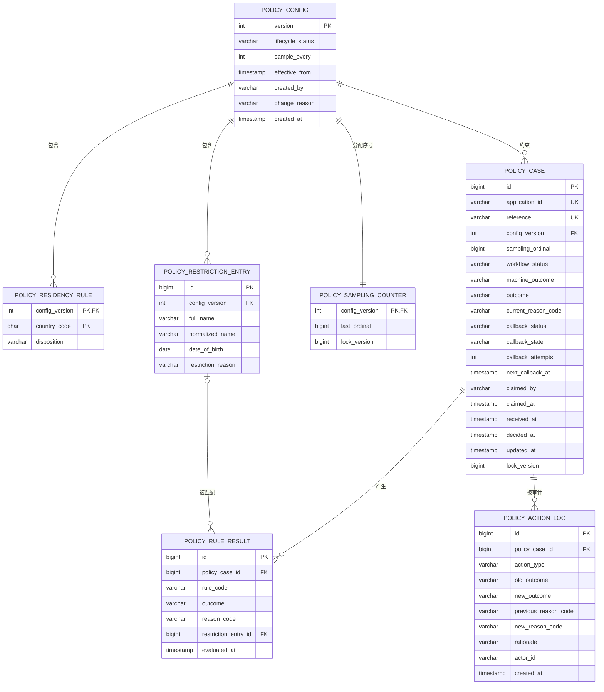
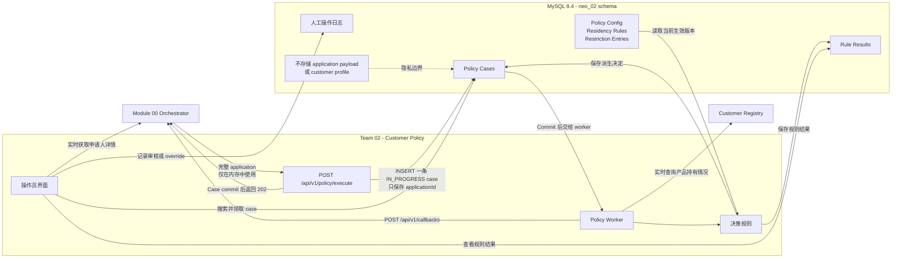

# Customer Policy 数据库 Schema 设计

[English version](./schema-design.md)

## 1. 目的

本文档为 Team 02 Customer Policy 模块提出数据库 Schema 设计。它仅作为设计与
实施指南，不会创建 migration，也不会改变当前应用的运行行为。

该设计支持以下核心能力：

- 每个 orchestrator application 对应一个 customer-policy case；
- 通过 customer registry 检查客户是否已经持有相同产品；
- 执行税务居民政策检查；
- 匹配银行自有的 restriction list；
- 将抽样案例或无法自动判断的案例转交人工审核；
- 记录人工决定及后续 override；
- 编辑带版本的 policy 配置并查看历史；
- 搜索 case 并统计 rejection patterns；
- 在不修改 orchestrator contract 的前提下重试和监控 callback。

## 2. 依据与强制约束

本设计基于：

- 仓库中的 `AGENTS.md` 和 `README.md`；
- `integrations/orchestrator` 下当前的 Java contract；
- Team 02 Customer Policy v5 student brief；
- capstone kickoff 材料。

Team 02 v5 brief 是本模块 contract 的 source of truth。如果当前仓库模板与 brief
冲突，本设计以 brief 为准：

- 入站接口：`POST /api/v1/policy/execute`；
- envelope command：`check-policy`；
- envelope 内容：`applicationId`、`correlationId`、`command`、完整
  `application`，以及 v5 `outputs` block；
- 立即返回：HTTP `202`，body 包含 `status`、`applicationId` 和 `command`；
- 异步 callback：`POST /api/v1/callbacks`；
- 业务 outcome：`APPROVED`、`REJECTED` 或 `REFERRED`。

Callback status 与 outcome 分开表达，并按 brief 映射：

| 场景 | Outcome | Callback status | Journey effect |
|---|---|---|---|
| 自动批准 | `APPROVED` | `completed` | 执行下一步骤 |
| 自动拒绝 | `REJECTED` | `rejected` | Journey 以 rejected 结束 |
| 自动转人工 | `REFERRED` | `application-manual` | 暂停并等待人工处理 |
| Queue decision 或 override | `APPROVED` 或 `REJECTED` | `local-manual` | 使用人工结果继续 journey |

数据库要求为 MySQL 8.4。Liquibase 负责管理 Schema，Hibernate 使用
`ddl-auto=validate`，因此 changeset 必须只追加，不能修改已经执行的 changeset。

本服务不能持久化 application payload，也不能创建本地 customer record。操作员查看
申请人详情时，必须使用 `application_id` 从 orchestrator 实时获取。

## 3. 设计决策

### 3.1 每个 application 只有一个 case

`policy_case.application_id` 来自 request envelope，而不是嵌套 application 对象中的
ID。唯一约束保证请求处理具有幂等性：同一个请求被重复发送时，服务应读取现有 case，
而不是创建第二个决定。

### 3.2 配置版本不可变

每个已评估 case 都指向当时使用的准确配置版本。已发布版本不可修改；编辑 policy 时
创建新版本，而不是修改历史 case 所引用的版本。

这样银行可以回答：“作出这个决定时使用的是哪一版政策？”

### 3.3 对需要过滤、关联或聚合的数据进行关系化

Residency rules、restriction entries、rule outcomes 和 audit actions 都使用关系表存储，
不使用 JSON，原因是系统需要：

- 执行唯一约束和外键约束；
- 搜索单个值；
- 聚合 rejection reasons；
- 为 restriction-list matching 建立索引；
- 保留清晰的审计历史。

核心 Schema 不需要 JSON。如果未来规则引擎产生结构不稳定的诊断数据，可以再增加一个
小型 JSON evidence snapshot，但其中不得包含 application payload 或 PII。

### 3.4 不使用 MySQL `ENUM`

Status 和 decision 字段使用 `VARCHAR`。允许值由 Java enum 和 service validation
定义。这样增加本地 workflow state 时不必立即修改数据库类型，同时保持 H2 测试与
MySQL 的兼容性。

### 3.5 区分机器 outcome 和当前 outcome

`machine_outcome` 保留规则引擎最初的结果；`outcome` 表示模块当前对外报告的结果。
人工审核或 override 可以改变 `outcome`，但不能覆盖 `machine_outcome`。

### 3.6 保存规则事实，而不是申请人数据

`policy_rule_result` 记录执行了哪条规则、规则结果和 reason code。它不保存姓名、
出生日期、地址、税务居民数组、registry response 或入站 JSON。

如果命中 restriction list，rule result 可以引用银行自有的
`policy_restriction_entry`。该 entry 是本模块拥有的 policy 配置，不是从申请中复制
的客户数据。

## 4. 图表

### 4.1 实体关系图



### 4.2 请求处理与数据归属



Request payload 仅在 worker 执行规则期间存在。MySQL 只保存 application ID、policy
版本、派生结果和审计元数据。申请人详情仍由 orchestrator 拥有，操作员打开 case 时
实时获取。

## 5. 表定义

### 5.1 `policy_config`

每一行代表一个完整的 policy 版本。

| 字段 | MySQL 类型 | 可空 | 约束/含义 |
|---|---|---:|---|
| `version` | `INT` | 否 | 主键；业务版本号，例如 `1`、`2`、`3` |
| `lifecycle_status` | `VARCHAR(16)` | 否 | `DRAFT`、`PUBLISHED` 或 `RETIRED` |
| `sample_every` | `INT` | 否 | 每 N 个符合条件的 case 转人工；必须大于 0 |
| `effective_from` | `TIMESTAMP(6)` | 是 | Draft 时为空；发布时必填 |
| `created_by` | `VARCHAR(100)` | 否 | 操作员或系统身份 |
| `change_reason` | `VARCHAR(500)` | 否 | 创建新版本的原因，必填 |
| `created_at` | `TIMESTAMP(6)` | 否 | 默认 `CURRENT_TIMESTAMP(6)` |

建议索引：

- 主键 `version`；
- `(lifecycle_status, effective_from)` 索引。

业务规则：

- 任意时间点只能有一个生效的 published version；
- 发布后不能修改 policy 内容；
- 创建新版本时，应先复制上一版本的规则，再进行编辑；
- `sample_every` 属于决策政策，因此保存在配置版本中。

MySQL 没有简单且可移植的 partial unique index 来约束“唯一 active row”。发布操作必须
在一个事务中执行：锁定相关 config rows、验证版本时间线，然后发布新版本。

### 5.2 `policy_residency_rule`

每一行表示某个 policy 版本中一个 ISO country code 的分类。

| 字段 | MySQL 类型 | 可空 | 约束/含义 |
|---|---|---:|---|
| `config_version` | `INT` | 否 | FK → `policy_config.version` |
| `country_code` | `CHAR(2)` | 否 | 大写 ISO 3166-1 alpha-2 code |
| `disposition` | `VARCHAR(16)` | 否 | `SUPPORTED` 或 `EXCLUDED` |

主键：`(config_version, country_code)`。

决策语义：

- `EXCLUDED` 表示明确拒绝，reason code 为
  `POL_TAX_RESIDENCY_EXCLUDED`；
- `SUPPORTED` 表示该 residency 检查通过；
- 当前版本中没有配置的国家视为 unsupported，reason code 为
  `POL_TAX_RESIDENCY_UNSUPPORTED`；
- 申请人有多个 tax residencies 时，任意一个 excluded country 都优先拒绝；
- 只有全部国家都为 supported，该规则才通过。

复合主键保证同一国家在同一版本中不能同时是 supported 和 excluded。

### 5.3 `policy_restriction_entry`

保存银行自有的 restriction list，并随 policy 配置进行版本化。

| 字段 | MySQL 类型 | 可空 | 约束/含义 |
|---|---|---:|---|
| `id` | `BIGINT` | 否 | Auto-increment 主键 |
| `config_version` | `INT` | 否 | FK → `policy_config.version` |
| `full_name` | `VARCHAR(200)` | 否 | 授权操作员录入的显示值 |
| `normalized_name` | `VARCHAR(200)` | 否 | 用于精确匹配的规范化姓名 |
| `date_of_birth` | `DATE` | 否 | 已验证的配置值 |
| `restriction_reason` | `VARCHAR(500)` | 否 | 内部 restriction 原因 |
| `created_at` | `TIMESTAMP(6)` | 否 | 默认 `CURRENT_TIMESTAMP(6)` |

约束和索引：

- 唯一约束 `(config_version, normalized_name, date_of_birth)`；
- 匹配索引 `(config_version, normalized_name, date_of_birth)`；
- FK → `policy_config`，禁止级联删除。

姓名规范化必须由一个确定性的 application-level function 完成，并测试大小写、连续
空格、标点符号和 Unicode 输入。数据库只保存规范化结果，不应再定义另一套不同的
规范化规则。

如果一个 entry 在新版本中继续有效，需要复制到新的 config version。只要仍有 case
引用历史版本，就不能删除该版本及其 restriction entries。

### 5.4 `policy_sampling_counter`

该表保存 operational state，用于在每个配置版本内分配精确且并发安全的连续序号。

| 字段 | MySQL 类型 | 可空 | 约束/含义 |
|---|---|---:|---|
| `config_version` | `INT` | 否 | PK，同时 FK → `policy_config.version` |
| `last_ordinal` | `BIGINT` | 否 | 最近分配的序号，初始值为 `0` |
| `lock_version` | `BIGINT` | 否 | JPA optimistic-lock version |

处理新 application 时，service 锁定 counter row，增加 `last_ordinal`，并在同一事务中
将结果写入 `policy_case.sampling_ordinal`。抽样条件为：

```text
sampling_ordinal % sample_every == 0
```

这比直接使用 auto-increment case ID 更可靠，因为 MySQL 的 insert 回滚后可能留下
序号空洞，进而跳过本应抽样的 case。

### 5.5 `policy_case`

每个 application 对应一条持久化的本地记录。它只包含 decision 和 workflow metadata，
不包含 application payload。

| 字段 | MySQL 类型 | 可空 | 约束/含义 |
|---|---|---:|---|
| `id` | `BIGINT` | 否 | Auto-increment 主键 |
| `application_id` | `VARCHAR(64)` | 否 | Request envelope 中的唯一 ID |
| `reference` | `VARCHAR(32)` | 否 | 操作员使用的唯一 reference |
| `config_version` | `INT` | 是 | FK → 本 case 使用的 policy version；worker 启动前为空 |
| `sampling_ordinal` | `BIGINT` | 是 | Off-thread worker 为抽样分配的序号 |
| `workflow_status` | `VARCHAR(32)` | 否 | 本地处理状态 |
| `machine_outcome` | `VARCHAR(16)` | 是 | 规则引擎最初的结果 |
| `outcome` | `VARCHAR(16)` | 是 | 当前符合 brief contract 的业务 outcome |
| `current_reason_code` | `VARCHAR(64)` | 是 | 当前 outcome 的主要 reason |
| `callback_status` | `VARCHAR(32)` | 是 | 当前 outcome 对应的 brief callback status |
| `callback_state` | `VARCHAR(16)` | 否 | Callback 发送状态 |
| `callback_attempts` | `INT` | 否 | 初始值为 `0` |
| `last_callback_at` | `TIMESTAMP(6)` | 是 | 最近一次 callback 尝试时间 |
| `next_callback_at` | `TIMESTAMP(6)` | 是 | 下次重试时间 |
| `claimed_by` | `VARCHAR(100)` | 是 | 当前 manual reviewer |
| `claimed_at` | `TIMESTAMP(6)` | 是 | Reviewer 领取 case 的时间 |
| `received_at` | `TIMESTAMP(6)` | 否 | 本服务接受请求的时间 |
| `decided_at` | `TIMESTAMP(6)` | 是 | 当前决定产生的时间 |
| `updated_at` | `TIMESTAMP(6)` | 否 | 最近状态更新时间 |
| `lock_version` | `BIGINT` | 否 | JPA optimistic-lock version |

允许值：

- `workflow_status`：`IN_PROGRESS`、`AWAITING_REVIEW`、`COMPLETED`；
- outcome：`APPROVED`、`REJECTED`、`REFERRED`；
- `callback_status`：`completed`、`rejected`、`application-manual`、
  `local-manual`；
- `callback_state`：`PENDING`、`SENT`、`FAILED`。

约束和索引：

- `application_id` 唯一；
- `reference` 唯一；
- `(config_version, sampling_ordinal)` 唯一；
- `(workflow_status, received_at)` 索引，用于 referral queue；
- `(outcome, decided_at)` 索引，用于结果搜索；
- `(callback_state, next_callback_at)` 索引，用于 callback retry；
- `config_version` 索引，用于 policy history join；
- FK → `policy_config`，禁止级联删除。

`reference` 应保持稳定，并在 insert 后生成，例如 `POL-00001234`。它用于员工搜索和
界面展示；integration 继续使用 `application_id`。

### 5.6 `policy_rule_result`

每一行记录一个 case 的一项规则评估。

| 字段 | MySQL 类型 | 可空 | 约束/含义 |
|---|---|---:|---|
| `id` | `BIGINT` | 否 | Auto-increment 主键 |
| `policy_case_id` | `BIGINT` | 否 | FK → `policy_case.id` |
| `rule_code` | `VARCHAR(64)` | 否 | 稳定的技术规则 ID |
| `outcome` | `VARCHAR(16)` | 否 | `PASSED`、`FAILED`、`REFERRED`、`SKIPPED` 或 `ERROR` |
| `reason_code` | `VARCHAR(64)` | 是 | 稳定的业务 reason code |
| `restriction_entry_id` | `BIGINT` | 是 | 命中 restriction entry 时使用的 FK |
| `evaluated_at` | `TIMESTAMP(6)` | 否 | 评估时间 |

约束和索引：

- `(policy_case_id, rule_code)` 唯一；
- `(reason_code, evaluated_at)` 索引，用于 rejection-pattern reporting；
- `(outcome, evaluated_at)` 索引；
- 所有 FK 禁止级联删除。

初始 `rule_code`：

- `EXISTING_PRODUCT`；
- `TAX_RESIDENCY`；
- `RESTRICTION_LIST`；
- `MANUAL_SAMPLE`。

初始业务 `reason_code`：

- `POL_ALL_CHECKS_PASSED`；
- `POL_EXISTING_PRODUCT_HELD`；
- `POL_TAX_RESIDENCY_UNSUPPORTED`；
- `POL_TAX_RESIDENCY_EXCLUDED`；
- `POL_CUSTOMER_BLOCKED`；
- `POL_SAMPLED_FOR_REVIEW`；
- `POL_REGISTRY_UNAVAILABLE`；
- `POL_MANUAL_APPROVED`；
- `POL_MANUAL_DECLINED`。

Rejection patterns 的统计查询直接使用该表，而不是解析 `policy_case` 中的 JSON。

### 5.7 `policy_action_log`

用于记录操作员行为的 append-only audit log。

| 字段 | MySQL 类型 | 可空 | 约束/含义 |
|---|---|---:|---|
| `id` | `BIGINT` | 否 | Auto-increment 主键 |
| `policy_case_id` | `BIGINT` | 否 | FK → `policy_case.id` |
| `action_type` | `VARCHAR(32)` | 否 | 操作类型 |
| `old_outcome` | `VARCHAR(16)` | 是 | 操作前的 outcome |
| `new_outcome` | `VARCHAR(16)` | 是 | 操作后的 outcome |
| `previous_reason_code` | `VARCHAR(64)` | 是 | 操作前的主要 reason |
| `new_reason_code` | `VARCHAR(64)` | 是 | 操作后的主要 reason |
| `rationale` | `VARCHAR(1000)` | 是 | Decision 或 override 时必填 |
| `actor_id` | `VARCHAR(100)` | 否 | 已认证的员工身份 |
| `created_at` | `TIMESTAMP(6)` | 否 | 默认 `CURRENT_TIMESTAMP(6)` |

初始 `action_type`：

- `CLAIM`；
- `RELEASE`；
- `MANUAL_DECISION`；
- `OVERRIDE`。

索引：

- `(policy_case_id, created_at)`；
- `(actor_id, created_at)`；
- `(action_type, created_at)`。

应用不能更新或删除 audit log。当前 queue state 保存在 `policy_case` 中；该表用于解释
当前状态是如何形成的。

## 6. 决策优先级

规则应按照一致的优先级评估和报告：

1. 已经持有产品：`REJECTED`。
2. 存在明确 excluded tax residency：`REJECTED`。
3. 存在 unsupported tax residency：`REJECTED`。
4. 命中 restriction list：`REJECTED`。
5. Registry 不可用或其他依赖无法确定：`REFERRED`。
6. Sampling rule 选中该 case：`REFERRED`。
7. 其他情况：`APPROVED`。

即使前面的 hard rejection 已经确定最终决定，仍可以记录其他适用规则的结果。如果因
必要数据缺失而无法安全执行规则，应记录 `ERROR` 或 `SKIPPED` 以及对应 reason code，
但不能持久化格式错误的原始值。

Callback payload 根据 `outcome`、`callback_status`、`current_reason_code` 和结构化
rule results 生成，并遵守 brief 锁定的 callback shape。不额外保存重复的自由文本，
避免意外持久化 applicant information。

## 7. 事务与并发边界

`/execute` intake 必须在返回 HTTP `202` 前完成以下步骤：

1. 验证 `applicationId` 和 `command`；
2. 以 `application_id` 为唯一键插入一条 `policy_case`，并设置
   `workflow_status = IN_PROGRESS`；
3. 如果 application 已存在，读取现有 case，不创建第二条记录，也不重复处理；
4. 提交 case；
5. 返回包含 `status`、`applicationId` 和 `command` 的 `202`；
6. 只有 commit 成功后，才启动 off-thread decision processing。

Request thread 不调用 registry，也不执行 policy rules。Application object 只传递给
内存中的 worker，绝不持久化。

已提交的 `IN_PROGRESS` row 是持久化的 hand-off。服务重启后，recovery worker 必须
使用 `application_id` 从 orchestrator 实时获取 application，并恢复遗留 case；恢复
不能依赖 orchestrator 再次发送 `/execute`。

Worker 随后执行：

1. 读取当前 config version 并分配 sampling ordinal；
2. 实时查询 registry 并执行 policy rules；
3. 提交 rule results、`machine_outcome`、`outcome`、`callback_status` 和 workflow
   state；
4. Decision commit 后发送 `POST /api/v1/callbacks`。

重复 `/execute` 不会再次执行规则或调用 registry。如果 case 已经产生结果，则重放已
保存的 outcome 和 callback status。

Callback 位于 decision transaction 之外。网络失败不能回滚已经产生的 policy
outcome。发送失败时，在一个简短的后续事务中更新 `callback_state`、
`callback_attempts` 和 `next_callback_at`。

Manual claim、manual decision 和 override 必须使用 `lock_version`。发生并发更新时应
返回 conflict，不能静默覆盖另一位操作员的工作。

## 8. 数据归属与隐私

允许持久化：

- Request envelope 中的 `application_id`；
- 本服务拥有的 policy configuration；
- 派生的 decisions 和 reason codes；
- callback delivery metadata；
- 员工 audit metadata。

禁止持久化：

- 入站 request JSON；
- application 中的 applicant name 或 date of birth；
- address、email、phone、nationality 或 tax-residency array；
- customer-registry response payload；
- 本地 customer profile。

Restriction list 的特殊之处是其中包含人员信息，但它是银行拥有的 policy input，
不是从 application 中复制的数据。只有经过授权的员工才能访问 restriction list 和
operator audit data。

## 9. 初始版本 Seed

初始 published policy version 应包含：

- Supported residencies：`GB`、`IE`、`PL`、`DE`、`FR`、`ES`、`NL`；
- Excluded residency：`US`；
- `sample_every = 7`；
- `Victor Sable`，出生日期 `1978-03-02`，原因 `prior fraud loss`；
- `Dana Kovacs`，出生日期 `1984-11-19`，原因 `account abuse`。

Seed data 必须通过 Liquibase 使用明确值插入。Application startup 不能静默地重新创建
或修改 policy versions。

## 10. Liquibase 实施顺序

现有的 `001-create-demo-showcase.yaml` 可能已经在部分环境执行，不能修改。

建议新增以下 changesets：

1. `002-create-policy-config.yaml`
2. `003-create-policy-config-rules.yaml`
3. `004-create-policy-case.yaml`
4. `005-create-policy-rule-result.yaml`
5. `006-create-policy-action-log.yaml`
6. `007-seed-policy-config-v1.yaml`
7. `008-drop-demo-showcase.yaml`

只有当 Java code、repositories、endpoints 和 tests 都不再引用 `DemoShowcase` 时，才能
增加 changeset `008`。

每个 changeset 应包含 indexes、foreign keys，并在 rollback 确实安全时提供 rollback。
Production repair 不能被当作常规 migration 手段。

## 11. 验证策略

实现应在两个层级进行验证：

- `./mvnw test`：使用 MySQL compatibility mode 的 H2，覆盖 entity validation、
  idempotency、rule precedence、config version selection 和 manual workflow；
- `./mvnw verify -DskipITs=false`：使用 Testcontainers MySQL 8.4，覆盖 Liquibase、
  indexes、foreign keys、timestamp precision、locking 和真实查询行为。

Referral queue、rejection-pattern report 和 callback retry worker 使用的查询，应使用有
代表性的数据量测试，并在部署 production 前在 MySQL 上检查 `EXPLAIN`。

## 12. 延后决定的内容

以下内容暂不进入第一版 Schema：

- 完整 callback-attempt history：只有当操作员确实需要查看每次 HTTP attempt、
  response code 和 failure category 时，才增加独立的 append-only table；
- 任意 JSON rule evidence：只有真实规则无法使用稳定字段表示时才增加，并禁止保存
  application PII；
- Customer snapshots：当前 brief 明确禁止；详情继续由 orchestrator 管理；
- Tenure、partner consent 等 candidate rules：只有选择实施这些 use cases 后，才增加
  新的稳定 rule/reason codes 和 config tables。

这样可以让第一版实现保持可交付的规模，同时保留幂等性、可解释性、可审计性，以及未来
policy version history 的扩展能力。
