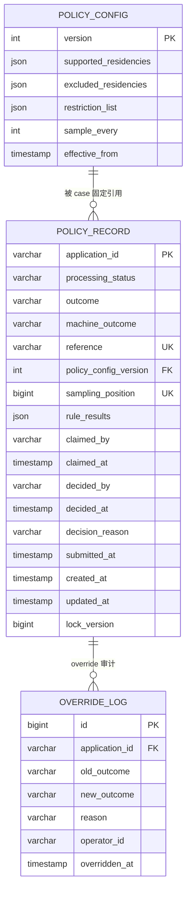
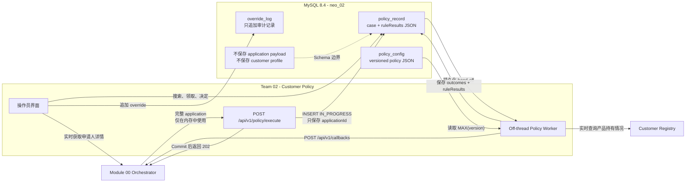

# Customer Policy 三表 Schema 设计

[English version](./schema-design.md)

## 1. 设计结论

Team 02 采用 Customer Policy v5 brief 建议的三个核心实体：

1. `policy_record`：每个 `applicationId` 一行；
2. `policy_config`：每个完整 policy version 一行，只允许 INSERT；
3. `override_log`：每次 manual override 一行，只追加、不删除。

本设计不会把 residency lists、restriction entries、rule results、sampling state 或一般
operator actions 拆成独立表。Brief 明确提醒团队不要从过于复杂的模型开始，而这三张表
已经能够覆盖 UC00-UC08 的全部锁定要求。

## 2. Source of Truth 与 Contract

Team 02 Customer Policy v5 brief 是本设计的 source of truth：

- 入站接口：`POST /api/v1/policy/execute`；
- command：`check-policy`；
- envelope：`applicationId`、`correlationId`、`command`、完整
  `application`，以及 v5 `outputs` block；
- 立即确认：HTTP `202`，body 包含 `status`、`applicationId` 和 `command`；
- 异步 callback：`POST /api/v1/callbacks`；
- outcome：`APPROVED`、`REJECTED`、`REFERRED`。

Callback 映射：

| 场景 | Outcome | Callback status | Journey effect |
|---|---|---|---|
| 自动批准 | `APPROVED` | `completed` | 继续执行下一步骤 |
| 自动拒绝 | `REJECTED` | `rejected` | 结束 journey |
| 自动转人工 | `REFERRED` | `application-manual` | 暂停并等待审核 |
| Queue decision 或 override | `APPROVED` 或 `REJECTED` | `local-manual` | 使用人工结果继续 journey |

只有 orchestrator 调用 `/execute`。Worker 可以使用完整 application，但绝不持久化
application payload。申请人详情通过本模块的 orchestrator proxy 实时获取。

目标数据库为 MySQL 8.4。Liquibase 负责 Schema，Hibernate 使用
`ddl-auto=validate`；migration 必须只追加。

## 3. 为什么三张表足够

| Use case | 所需存储 | 三表模型如何支持 |
|---|---|---|
| UC00 Process Application | `policy_record` | 返回 `202` 前插入一条 `IN_PROGRESS` row；唯一 `application_id` 保证幂等 |
| UC01 Search Cases | `policy_record` | 本地搜索 ID；姓名查询和申请人详情通过 orchestrator 实时获取；最多 10 条 |
| UC02 Review Decision | `policy_record` | 读取 `outcome`、`machine_outcome`、固定 config version 和 `rule_results` |
| UC03 View Applicant | 不需要 applicant table | 使用 `application_id` 代理 orchestrator，本地不保存 |
| UC04 Referral Queue | `policy_record` | 使用 outcome、claim 字段、人工决定字段和 optimistic locking |
| UC05 Rejection Patterns | `policy_record` | 在 `submitted_at` 时间范围内聚合 `rule_results` JSON 的 reason codes |
| UC06 Override Case | `policy_record` + `override_log` | 更新当前 outcome，并追加不可变的前后值审计记录 |
| UC07 Edit Policy Config | `policy_config` | 插入一个完整新版本，绝不更新旧版本 |
| UC08 Config History | `policy_config` | 读取全部版本；`MAX(version)` 是当前版本 |

Candidate rules UC09 和 UC10 可以在 versioned config document 中增加字段，并在
`rule_results` 中增加新 section，不需要为每条规则单独建表。

### 相对 suggested ER 的少量字段扩展

本设计保留 brief 的三个实体，只增加让 acceptance criteria 可验证所需的少量字段：

| 新增字段 | Justification |
|---|---|
| `processing_status` | UC00 要求 outcome 产生前已经存在持久化的 `IN_PROGRESS` 状态 |
| `sampling_position` | UC02 展示准确的首次决策 position，且 sampling 必须幂等 |
| `created_at`、`updated_at` | Operational ordering 和 recovery 不能依赖 applicant data |
| `lock_version` | UC04 要求两位 operator 同时领取同一 case 时确定性返回 `409` |
| `override_log.id` | 每条 append-only audit event 都需要稳定主键 |

这些只是三个建议实体上的字段，不是额外 domain table。

## 4. 实体关系图



## 5. 处理流程与数据归属



## 6. 表定义

### 6.1 `policy_record`

每个 orchestrator application 对应一条持久化记录。该表同时承担 case、queue item、
decision trace 和 reporting source 的职责。

| 字段 | MySQL 类型 | 可空 | 数据来源 | 约束/含义 |
|---|---|---:|---|---|
| `application_id` | `VARCHAR(64)` | 否 | Orchestrator `/execute` envelope | 主键；唯一保存的 applicant-related identifier |
| `processing_status` | `VARCHAR(24)` | 否 | Customer Policy service workflow | `IN_PROGRESS` 或 `DECIDED`；初始为 `IN_PROGRESS` |
| `outcome` | `VARCHAR(16)` | 是 | Rule engine、queue reviewer 或 override request | 当前结果：`APPROVED`、`REJECTED` 或 `REFERRED` |
| `machine_outcome` | `VARCHAR(16)` | 是 | Customer Policy rule engine | Sampling 和人工介入前规则 1-3 的结果；永不覆盖 |
| `reference` | `VARCHAR(32)` | 否 | Customer Policy service 在 insert 前生成 | 唯一操作员 reference |
| `policy_config_version` | `INT` | 是 | Worker 选择的 current `policy_config` | FK → 使用的 config；worker 启动前为空 |
| `sampling_position` | `BIGINT` | 是 | Customer Policy service sampling allocator | Every-X rule 使用的唯一首次决策序号 |
| `rule_results` | `JSON` | 是 | Rule engine，由内存 application、policy config 和 live registry result 派生 | 四个嵌入式 rule sections；处理期间为空 |
| `claimed_by` | `VARCHAR(100)` | 是 | 已认证 operator，来自 claim request | 当前领取 referred case 的 operator |
| `claimed_at` | `TIMESTAMP(6)` | 是 | Claim 成功时的 service/database clock | 领取时间 |
| `decided_by` | `VARCHAR(100)` | 是 | 已认证 operator，来自 manual-decision 或 override request | 人工决定者；机器结果保持不变时为空 |
| `decided_at` | `TIMESTAMP(6)` | 是 | Human decision 或 override 成功时的 service/database clock | 人工决定或 override 时间 |
| `decision_reason` | `VARCHAR(1000)` | 是 | Operator 的 manual-decision 或 override request | 人工决定时必填的原因 |
| `submitted_at` | `TIMESTAMP(6)` | 否 | Orchestrator `application.submittedAt`（brief 中列出；见下方说明） | 用于搜索排序和日期范围报告的提交时间 |
| `created_at` | `TIMESTAMP(6)` | 否 | Intake insert 时 MySQL `CURRENT_TIMESTAMP(6)` default | 本地 row 创建时间 |
| `updated_at` | `TIMESTAMP(6)` | 否 | Customer Policy service/MySQL update timestamp | Case 最近更新时间 |
| `lock_version` | `BIGINT` | 否 | JPA optimistic locking | Claim/decision 并发使用的 optimistic-lock version |

`submitted_at` 是唯一存在 source-of-truth 冲突的字段：suggested ER 以及
queue/reporting use case 包含该字段，但 UC00 又说明 application payload
只持久化 `applicationId`。在 instructor 明确意图之前，应选择省略
`submitted_at` 并使用本地 `created_at` 排序/报表，或者先获得明确许可再持久化
`application.submittedAt`。

约束和索引：

- 主键 `application_id`；
- `reference` 唯一；
- `sampling_position` 唯一；
- FK `policy_config_version -> policy_config.version`，禁止级联删除；
- `(processing_status, created_at)` 索引；
- `(outcome, submitted_at)` 索引；
- `(claimed_by, claimed_at)` 索引；
- `policy_config_version` 索引。

由于没有 numeric auto-increment case ID，`reference` 必须在 insert 前生成。可以使用
短随机值或 ULID 派生值，例如 `pol-01J2M8R4K9`，因此无需增加 sequence table；唯一
约束负责检测极低概率的冲突。

#### `rule_results` JSON 结构

```json
{
  "existingProduct": {
    "passed": true,
    "registryChecked": true,
    "reasonCodes": []
  },
  "taxResidency": {
    "passed": true,
    "matchedList": "SUPPORTED",
    "reasonCodes": []
  },
  "restrictionList": {
    "passed": true,
    "reasonCodes": []
  },
  "sampling": {
    "sampled": false,
    "position": 20,
    "reasonCodes": []
  }
}
```

该 JSON document 的规则：

- 四个 locked sections 与 machine outcome 一起写入；
- reason codes 使用数组，因为一个 case 可能贡献多个 reason；
- 不保存 applicant name、DOB、country list、registry payload 或其他原始 application
  value；
- Sampling position 必须与关系字段 `sampling_position` 一致；
- Manual decision 和 override 不得重写 machine rule results。

MySQL 8.4 可以使用 `JSON_TABLE` 展开所有 `reasonCodes` 数组，完成 UC05。该查询必须有
真实 MySQL integration test，因为 H2 compatibility mode 不能证明 MySQL JSON 查询
行为。

### 6.2 `policy_config`

每一行代表一个完整 policy document。该表只允许 INSERT：`MAX(version)` 是当前版本，
旧版本永久保留，用于解释历史 case。

| 字段 | MySQL 类型 | 可空 | 数据来源 | 约束/含义 |
|---|---|---:|---|---|
| `version` | `INT` | 否 | Customer Policy service 分配；version 1 由 Liquibase seed | 主键；新版本为 `MAX(version) + 1` |
| `supported_residencies` | `JSON` | 否 | Version 1 来自 Liquibase seed；后续版本来自 compliance officer `POST /config` | 大写 ISO alpha-2 country code JSON array |
| `excluded_residencies` | `JSON` | 否 | Version 1 来自 Liquibase seed；后续版本来自 compliance officer `POST /config` | 大写 ISO alpha-2 country code JSON array |
| `restriction_list` | `JSON` | 否 | Version 1 来自 Liquibase seed；后续版本来自 compliance officer `POST /config` | `{fullName, dateOfBirth, reason}` object array |
| `sample_every` | `INT` | 否 | Version 1 来自 Liquibase seed；后续版本来自 compliance officer `POST /config` | 每 X 个首次决定转人工；必须至少为 1 |
| `effective_from` | `TIMESTAMP(6)` | 否 | Immutable config version insert 时的 service/database clock | 该版本成为 current 的时间 |

示例：

```json
{
  "version": 1,
  "supportedResidencies": ["GB", "IE", "PL", "DE", "FR", "ES", "NL"],
  "excludedResidencies": ["US"],
  "restrictionList": [
    {
      "fullName": "Victor Sable",
      "dateOfBirth": "1978-03-02",
      "reason": "prior fraud loss"
    },
    {
      "fullName": "Dana Kovacs",
      "dateOfBirth": "1984-11-19",
      "reason": "account abuse"
    }
  ],
  "sampleEvery": 7
}
```

Insert 前验证：

- 两个 residency 值都是 JSON array；
- 每个 country 都是大写 ISO alpha-2；
- 同一 country 不能同时出现在两个 list；
- 每条 restriction entry 必须包含非空 `fullName`、ISO date
  `dateOfBirth` 和非空 `reason`；
- 使用 normalized name + DOB 拒绝重复 restriction entry；
- `sample_every >= 1`；
- 提交的 document 必须完整；缺失 list 不能从旧版本隐式继承。

这里适合使用 JSON，因为 UC07 写入、UC08 读取的都是整个 version。Brief 不要求对单个
residency 或 restriction row 做独立 CRUD、join 或 reporting。完整 document
versioning 还可以避免 case 同时读取到新旧 list 的混合状态。

发布新版本时，在一个事务中锁定当前最大版本，并插入 `MAX(version) + 1`。已有版本永不
更新或删除。

### 6.3 `override_log`

UC06 使用的 append-only audit trail。Queue decision 更新 `policy_record` 的 decision
字段；该表只记录后续 manual override。

| 字段 | MySQL 类型 | 可空 | 数据来源 | 约束/含义 |
|---|---|---:|---|---|
| `id` | `BIGINT` | 否 | MySQL auto-increment | 主键 |
| `application_id` | `VARCHAR(64)` | 否 | Override URL path 以及被引用的 `policy_record` | FK → `policy_record.application_id` |
| `old_outcome` | `VARCHAR(16)` | 否 | Override transaction 内读取的当前 `policy_record.outcome` | Override 前的 outcome |
| `new_outcome` | `VARCHAR(16)` | 否 | Operator 的 override request | `APPROVED`、`REJECTED` 或 `REFERRED` |
| `reason` | `VARCHAR(1000)` | 否 | Operator 的 override request | Operator 必填 justification |
| `operator_id` | `VARCHAR(100)` | 否 | 已认证 operator；auth 接入前暂来自 request field | 已认证的 operator identity |
| `overridden_at` | `TIMESTAMP(6)` | 否 | Override 成功时的 service/database clock | Override 时间 |

约束和索引：

- FK → `policy_record`，禁止级联删除；
- `(application_id, overridden_at)` 索引；
- `(operator_id, overridden_at)` 索引。

Override transaction 更新 `policy_record.outcome` 和 decision metadata，并插入一条
`override_log`。它绝不修改 `machine_outcome`、`policy_config_version`、
`sampling_position` 或 `rule_results`。

## 7. 不增加第四张表的 Sampling 设计

Brief 要求每 X 个首次 policy decision 转人工，并在
`ruleResults.sampling.position` 中展示 position。

Worker 在一个短事务中分配 `sampling_position`：

1. 使用 `SELECT ... FOR UPDATE` 锁定 current `policy_config` row；
2. 读取 `MAX(policy_record.sampling_position) + 1`；
3. 设置 case 的 config version 和 sampling position；
4. 立即 commit；
5. 在锁外执行 registry 和 rule calls。

`sampling_position` 唯一约束是最后的并发保护。这样可以把精确 sampling 保留在
`policy_record` 中，而不引入单独的 counter entity。必须在 MySQL 8.4 上使用并发
worker 测试该分配过程。

抽样条件：

```text
sampling_position % sample_every == 0
```

每个新 `application_id` 只执行一次 sampling；重复 `/execute` 不会再分配 position。

## 8. Intake、幂等与 Callback 流程

返回 `202` 前：

1. 验证 `applicationId` 和 `command = check-policy`；
2. 插入一条 `processing_status = IN_PROGRESS` 的 `policy_record`；
3. 如果 `application_id` 重复，则读取现有 row；
4. commit；
5. 返回锁定的 acknowledgement body；
6. 只有 commit 后才触发处理。

Request thread 不调用 provider，也不执行 policy rule。已提交的 row 是持久化
hand-off。Recovery 扫描遗留的 `IN_PROGRESS` rows，并从 orchestrator 实时获取
application；payload 仍然不落库。

Decision worker 在一个事务中保存 config version、position、rule results、outcomes 和
`processing_status = DECIDED`，然后发送 callback。

重复 `/execute` 时：

- `IN_PROGRESS` case 仍返回 acknowledgement，但不会启动第二个 worker；
- 已决定 case 不会重跑规则，也不会再次查询 registry；
- 使用已存储的 outcome，并根据 outcome 和人工决定 metadata 推导 callback status
  后重放 callback。

## 9. 人工 Queue 与 Override 并发

Claim 使用 optimistic update：

```text
UPDATE policy_record
SET claimed_by = ?, claimed_at = ?, lock_version = lock_version + 1
WHERE application_id = ?
  AND outcome = 'REFERRED'
  AND claimed_by IS NULL
  AND lock_version = ?
```

更新 0 行时返回 HTTP `409`。Release 必须由同一 operator 执行。

Queue decision 要求 outcome 为 `APPROVED` 或 `REJECTED`，并要求 `operator` 和非空
reason。它更新 `outcome`、`decided_by`、`decided_at`、`decision_reason`，但不修改
machine fields，然后发送 `local-manual` callback。

Override 使用相同 optimistic-lock 规则，并额外插入一条 `override_log`。

## 10. 数据归属与隐私

允许存储：

- `application_id`；
- case 时间与 workflow metadata；
- 派生 outcomes 和 rule reason codes；
- 带版本的银行自有 policy configuration；
- operator claim、decision 和 override audit metadata。

禁止存储：

- 入站 request JSON；
- application 中的 applicant name、DOB、address、email、phone、nationality 或
  tax-residency array；
- customer-registry response payload；
- 本地 customer profile。

Restriction list 是银行自有 policy data，不是从 applicant 复制的数据，但仍必须只允许
授权员工访问。自由文本 decision 和 override reason 应明确提示 operator 不要输入
applicant PII。

## 11. Liquibase 计划

绝不能修改已经执行的 `001-create-demo-showcase.yaml`。

建议增加以下 append-only changesets：

1. `002-create-policy-config.yaml`
2. `003-create-policy-record.yaml`
3. `004-create-override-log.yaml`
4. `005-seed-policy-config-v1.yaml`
5. `006-drop-demo-showcase.yaml`

只有当 Java code、repository、endpoint 和 test 都不再引用 `DemoShowcase` 时，才能增加
`006`。

## 12. 验证策略

使用 H2 的 Docker-free tests：

- 重复 `/execute` 只创建一行；
- Row 在返回 `202` 前完成 commit；
- Config 和 rule validation；
- Decision precedence 和 reason-code shape；
- Claim/release conflict；
- Manual decision 和 override audit。

MySQL 8.4 Testcontainers integration tests：

- Liquibase 和 `ddl-auto=validate`；
- JSON persistence 和 `JSON_TABLE` reason aggregation；
- 并发 config version 分配；
- 并发 sampling-position 分配；
- foreign keys、unique constraints 和 timestamp precision。

该模型有意接受更复杂的 JSON 查询，以换取直接符合 brief 的更小 domain model。只有当
durable callback-attempt tracking 成为已确认要求时，才应增加 callback outbox 等第四张
operational table。
