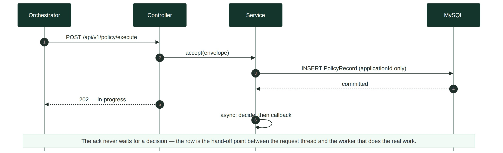
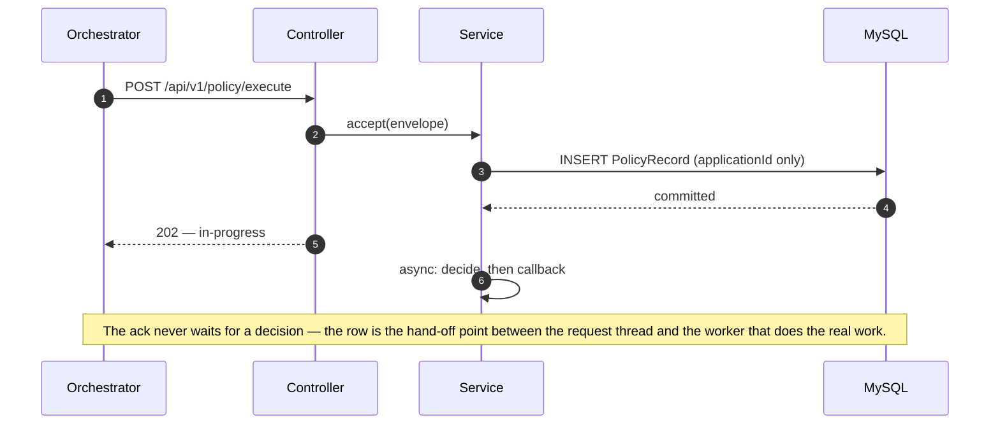
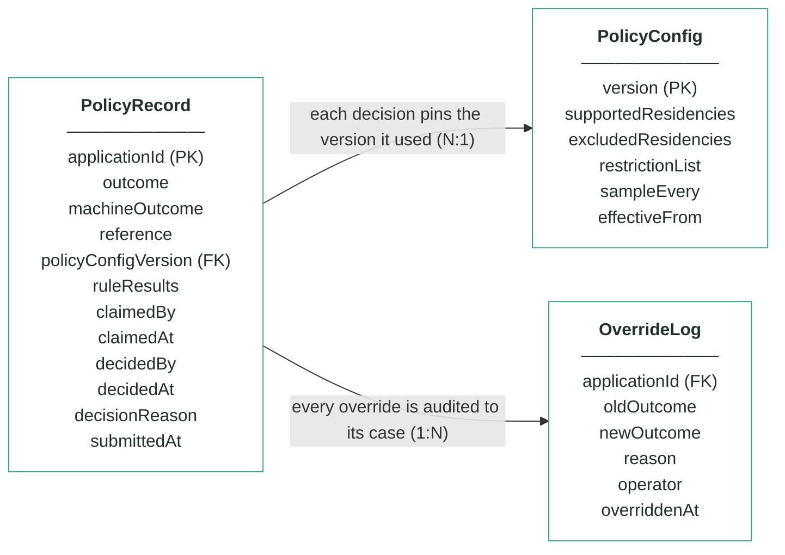
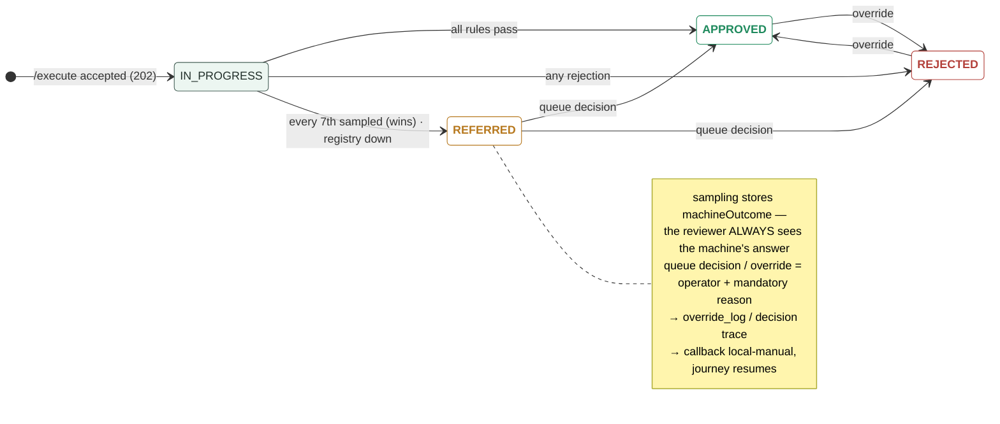

# Module 2 · Customer Policy — UC 00 · Process Application

> AI implementation brief, generated from the v5 spec (`spec/.../use-cases/`). Source of truth is the spec; regenerate, don't hand-edit.

## Context

- Module: 2 · Customer Policy · category Rule · domain `policy` · command `check-policy` · outcomes: APPROVED, REFERRED, REJECTED
- Use case: 00 · Process Application · track B · prerequisite: none (foundation) · build shape: API→DB · primary screen: — feeds every screen (row visible on the board)
- Data effect: one INSERT + 202 ack
- Platform rules (non-negotiable): the orchestrator is the only caller; the whole application arrives in the envelope (plus the v5 `outputs` block, Option A); steps are independent and re-orderable; the payload is NEVER stored — only `applicationId`; every module ships `GET /cases/{id}/applicant` proxying the orchestrator; big lists are empty by default and capped at 10 rows (≤10 hydration calls); ALL APIs are idempotent — same request twice, same result once; every endpoint appears in the service's OpenAPI 3.0 (Swagger) spec.

## Story

As the orchestrator I need every execute request acknowledged immediately and recorded durably, so the journey can advance and every other use case has a row to work on.

## Contract

```
POST /api/v1/policy/execute
{ applicationId, correlationId,
  command: "check-policy",
  application: { … }, outputs: { … } }
→ 202 Accepted
{ "status": "in-progress",
  "applicationId": "app-1234",
  "command": "check-policy" }
```

## Acceptance criteria

1. POST /api/v1/policy/execute with a valid envelope → 202 Accepted immediately — no rule or provider work happens on the request thread; body carries status "in-progress", the applicationId and the command.
2. Before the 202 is sent, exactly ONE PolicyRecord row exists, keyed by applicationId, in an in-progress state — a crash right after the ack loses nothing.  ⟵ **checkpoint — exact value**
3. Only the applicationId is persisted from the envelope — zero payload columns; the application object is handed to the off-thread worker, never stored.
4. Repeated /execute for the same applicationId → 202 again, still one row, no re-processing; once decided, the callback replays the stored outcome.
5. A malformed envelope (missing applicationId or command) → 400 with a JSON error body, and nothing is stored.
6. The off-thread decision starts only after the row is committed — everything in this module triggers from this row.
7. The new row is immediately visible to the search and case endpoints as an in-progress case.

## Expected data changes

- **INSERT one PolicyRecord row** keyed by applicationId — the ONLY applicant data ever stored.
- The row starts in-progress; every later use case UPDATEs or reads this same row.
- Idempotency = the unique key on applicationId; the trigger point = the commit.

## The Application entity — every field that arrives in the API

> The whole Application object is delivered in the envelope on every call. Fields this module reads are marked ●. The payload is NEVER stored — only `applicationId`.

| field | example | meaning |
|---|---|---|
| ● applicationId | app-1234 | journey key — every record this module stores is keyed by it, and the registry read quotes it in its audit trail |
| channel | MOBILE_APP | where the application was made — module 1's channel-eligibility input, not policy's business |
| submittedAt | 2026-07-21T21:40:00Z | when the customer submitted — timestamps always UTC |
| ● applicant.fullName | Maria Nowak | rule 1: registry lookup key (with DOB) · rule 3: exact match against the restriction list, normalised the same way |
| ● applicant.dateOfBirth | 1996-04-11 | rule 1 + rule 3: the second half of both lookups — names collide, name+DOB almost never does |
| applicant.email / mobile | maria@…  +4477… | contact detail for module 6's agreement — policy never touches it |
| applicant.nationality | PL | module 3 cross-checks the identity document — NOT a policy input: residency is about tax, not passports |
| applicant.countryOfResidence | GB | module 4's jurisdiction-risk input — deliberately not read here; tax residency is the policy fact |
| ● applicant.taxResidencies | ["GB"] | rule 2's whole input: at least one on the supported list, none on the excluded list — an exclusion wins |
| applicant.currentAddress | 42 Hanbury St, E1 5JP | module 8 posts the card here — policy ignores it |
| identityDocument.* | PASSPORT · ZS1234567 | module 3 sends it to the identity provider — not policy's job |
| employment.status / employerName / months | PERMANENT · 11 | module 5's affordability inputs — policy decides relationship, not repayment |
| finances.annualIncome | 34000 | module 5 decides the limit from it — no policy rule reads money |
| finances.monthlyHousingCost / existingCreditCommitments | 1000 · 180 | module 5's DTI calculation — ignored here |
| product.productCode | CREDIT_CARD_REWARDS | module 1 checks it is on sale · rule 1 rejects on ANY product held, so policy does not even read which one is requested — candidate 10 (partner products) would change that |
| product.requestedCreditLimit | 3000 | module 5 caps against it — policy has no opinion on amounts |
| delivery.useCurrentAddress / address | true · null | module 8's delivery decision — ignored here |
| consents.termsAccepted | true | module 1 enforces it, module 6 re-reads it — policy assumes it arrived true |
| consents.paperless / marketingConsent | true · false | marketingConsent is candidate 10's input — partner products need consent to share data with the partner; not read by any locked rule |
| outputs  (v5 · Option A) | { } | step results accumulated by the orchestrator as the saga advances — approvedLimit/APR after step 5, agreementId after 6. Nothing policy needs: this module never reads it |

_Ground rules: unknown fields are ignored on the way in and never emitted on the way out · countries ISO alpha-2 uppercase · dates YYYY-MM-DD · money = integer GBP · optional = null, never "" or 0._

## Diagrams

> Rendered images first (for PDF/preview); the mermaid source is collapsed underneath for machine consumption.

### Sequence — this use case



<details><summary>mermaid source</summary>



</details>

### Entity model (suggested — the shape to beat)


**PolicyRecord — one row per applicationId (unique)**

| field | type | key | meaning |
|---|---|---|---|
| applicationId | string | PK | the journey key from the envelope — one row per application, and the ONLY applicant-related column |
| outcome | enum |  | the final answer: APPROVED, REFERRED or REJECTED — starts equal to machineOutcome; only a human decision changes it |
| machineOutcome | enum |  | what rules 1–3 computed before sampling — shown to the reviewer, never changed |
| reference | string |  | human-facing case reference shown on every screen, e.g. pol-000187 |
| policyConfigVersion | int | FK | the PolicyConfig version that decided this case — pinned forever, never re-pointed |
| ruleResults | JSON |  | embedded results of the four checks — existingProduct (with registryChecked), taxResidency (with matchedList), restrictionList, sampling (sampled + position) |
| claimedBy | string, nullable |  | referral queue — the operator who claimed the case |
| claimedAt | timestamp, nullable |  | referral queue — when it was claimed |
| decidedBy | string, nullable |  | who made the human decision (queue or override) — null means the machine's answer stands |
| decidedAt | timestamp, nullable |  | when the human decision was made |
| decisionReason | string, nullable |  | the mandatory reason recorded with every human decision |
| submittedAt | timestamp |  | when the orchestrator submitted the case |

**PolicyConfig — insert-only, versioned lists; the current version is the highest**

| field | type | key | meaning |
|---|---|---|---|
| version | int | PK | one new row per change — rows are inserted, never updated |
| supportedResidencies | string[] |  | rule 2 — at least one tax residency must be on this list, else REJECTED (seeded GB, IE, PL, DE, FR, ES, NL) |
| excludedResidencies | string[] |  | rule 2 — any residency on this list REJECTS, even beside a supported one (seeded US) |
| restrictionList | JSON |  | rule 3 — the bank's own blocked people as {fullName, dateOfBirth, reason} entries (seeded Victor Sable and Dana Kovacs) |
| sampleEvery | int |  | rule 4's X — every Xth first-time decision is REFERRED for human review (seeded 7) |
| effectiveFrom | timestamp |  | when this version became the current one |

**OverrideLog — audit trail; one row per manual override, none ever deleted**

| field | type | key | meaning |
|---|---|---|---|
| applicationId | string | FK | the case that was overridden |
| oldOutcome | enum |  | the outcome before the override |
| newOutcome | enum |  | the outcome after the override |
| reason | string |  | the mandatory justification typed by the operator |
| operator | string |  | who performed the override |
| overriddenAt | timestamp |  | when it happened |

Relationships: PolicyRecord N:1 PolicyConfig — each decision pins the version it used · PolicyRecord 1:N OverrideLog — every override is audited to its case

<details><summary>mermaid source (generated from the spec tables)</summary>



</details>

### State transitions — the case record


<details><summary>mermaid source</summary>



</details>

## Out of scope

Deciding anything (that is the engine use case, which runs off-thread AFTER this row exists); the callback content.

## Build notes

Partially implemented by the template — the 202-then-callback controller is given. Your work: the durable PolicyRecord row, idempotency by applicationId, and the async hand-off. EVERY other use case depends on this one: no row, no review, no queue, no override, no report.

## Tests

Slice test: 202 shape + row inserted before the ack returns; repeated /execute → one row; malformed envelope → 400 and nothing stored.

## Sequence caption

The ack never waits for a decision — the row is the hand-off point between the request thread and the worker that does the real work.

## Definition of done

All acceptance criteria verified against the running app · `./mvnw test` green · teammate-reviewed PR merged to main · fresh clone builds green · endpoint idempotent + present in the OpenAPI 3.0 (Swagger) spec · demoable from the UI.
