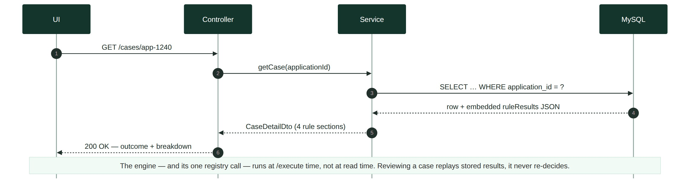
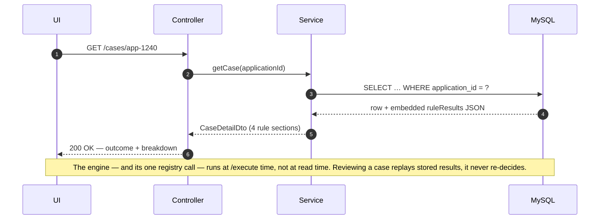
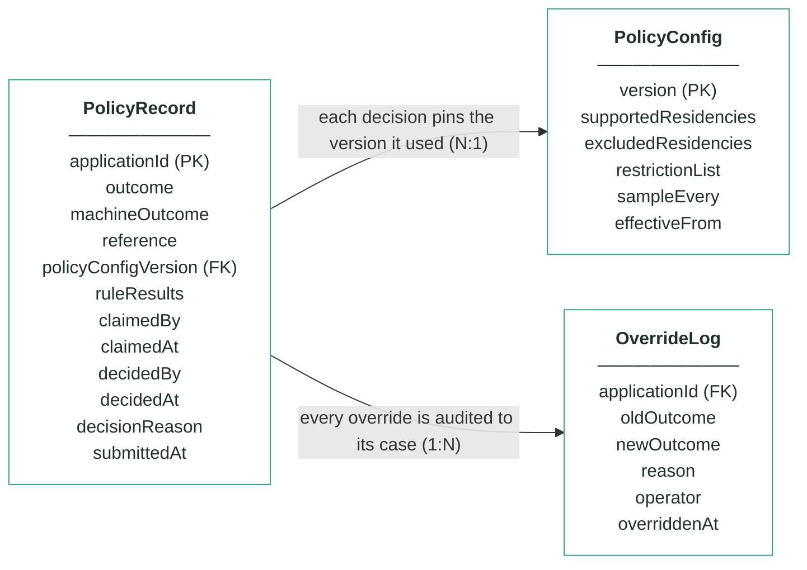
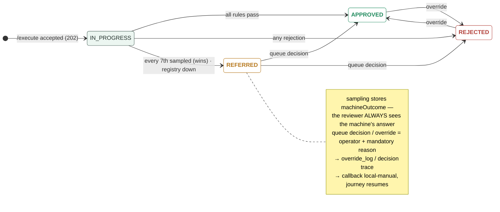

# Module 2 · Customer Policy — UC 02 · Review Decision

> AI implementation brief, generated from the v5 spec (`spec/.../use-cases/`). Source of truth is the spec; regenerate, don't hand-edit.

## Context

- Module: 2 · Customer Policy · category Rule · domain `policy` · command `check-policy` · outcomes: APPROVED, REFERRED, REJECTED
- Use case: 02 · Review Decision · track B · prerequisite: after 00 + 07 — the engine decides against PolicyConfig · build shape: API+FE (engine: DB) · primary screen: Decision Detail
- Data effect: read-only (row written earlier)
- Platform rules (non-negotiable): the orchestrator is the only caller; the whole application arrives in the envelope (plus the v5 `outputs` block, Option A); steps are independent and re-orderable; the payload is NEVER stored — only `applicationId`; every module ships `GET /cases/{id}/applicant` proxying the orchestrator; big lists are empty by default and capped at 10 rows (≤10 hydration calls); ALL APIs are idempotent — same request twice, same result once; every endpoint appears in the service's OpenAPI 3.0 (Swagger) spec.

## Story

As a bank employee I want to open a policy decision and see its outcome and full rule breakdown — including what the machine decided before sampling forced it to a person.

## Contract

```
GET /cases/{applicationId} →
{"outcome":"REJECTED","machineOutcome":"REJECTED",
 "reference":"pol-000214",
 "policyConfigVersion":1,
 "ruleResults":[{"ruleName":"taxResidency",
   "passed":false,
   "reasonCodes":["POL_TAX_RESIDENCY_EXCLUDED"]},…]}
```

## Acceptance criteria

1. GET /cases/{applicationId} → 200 + outcome, machineOutcome, reference, policyConfigVersion, ruleResults[] (4 sections: existingProduct, taxResidency, restrictionList, sampling — each passed + reasonCodes[]).
2. Maria Nowak (app-1234) → APPROVED, all three rule sections passed, sampling not triggered, reasons = [POL_ALL_CHECKS_PASSED].  ⟵ **checkpoint — exact value**
3. Sofia Ruiz (app-1240), tax resident GB + US → REJECTED with POL_TAX_RESIDENCY_EXCLUDED — the supported GB residency does NOT rescue her; the exclusion wins.  ⟵ **checkpoint — exact value**
4. James Whitfield (app-1242), ACTIVE card in the registry → REJECTED with POL_EXISTING_PRODUCT_HELD; ruleResults.existingProduct records registryChecked = true.  ⟵ **checkpoint — exact value**
5. An applicant failing two rules at once reports BOTH rejection reasons — never just the first found.
6. The fixture's 21st policy decision (app-1287) → REFERRED with POL_SAMPLED_FOR_REVIEW, machineOutcome APPROVED, sampling.position = 21 — sampling outranks a clean pass.  ⟵ **checkpoint — exact value**
7. Registry unreachable after 3 tries → REFERRED with POL_REGISTRY_UNAVAILABLE; the other rules' results are still recorded.
8. Repeated /execute for the same applicationId → still one row, rules NOT re-run, no second registry call, callback replays the stored outcome.
9. Unknown applicationId → 404 with a JSON error body (never a 500).

## Expected data changes

- **This GET changes nothing.** The row it reads was written once, off-thread, by /execute.
- On /execute: INSERT policy_record (outcome, machineOutcome, ruleResults JSON, policyConfigVersion pinned).
- Unique key on application_id is what makes the idempotency AC provable.

## Diagrams

> Rendered images first (for PDF/preview); the mermaid source is collapsed underneath for machine consumption.

### Sequence — this use case



<details><summary>mermaid source</summary>



</details>

### Entity model (suggested — the shape to beat)


**PolicyRecord — one row per applicationId (unique)**

| field | type | key | meaning |
|---|---|---|---|
| applicationId | string | PK | the journey key from the envelope — one row per application, and the ONLY applicant-related column |
| outcome | enum |  | the final answer: APPROVED, REFERRED or REJECTED — starts equal to machineOutcome; only a human decision changes it |
| machineOutcome | enum |  | what rules 1–3 computed before sampling — shown to the reviewer, never changed |
| reference | string |  | human-facing case reference shown on every screen, e.g. pol-000187 |
| policyConfigVersion | int | FK | the PolicyConfig version that decided this case — pinned forever, never re-pointed |
| ruleResults | JSON |  | embedded results of the four checks — existingProduct (with registryChecked), taxResidency (with matchedList), restrictionList, sampling (sampled + position) |
| claimedBy | string, nullable |  | referral queue — the operator who claimed the case |
| claimedAt | timestamp, nullable |  | referral queue — when it was claimed |
| decidedBy | string, nullable |  | who made the human decision (queue or override) — null means the machine's answer stands |
| decidedAt | timestamp, nullable |  | when the human decision was made |
| decisionReason | string, nullable |  | the mandatory reason recorded with every human decision |
| submittedAt | timestamp |  | when the orchestrator submitted the case |

**PolicyConfig — insert-only, versioned lists; the current version is the highest**

| field | type | key | meaning |
|---|---|---|---|
| version | int | PK | one new row per change — rows are inserted, never updated |
| supportedResidencies | string[] |  | rule 2 — at least one tax residency must be on this list, else REJECTED (seeded GB, IE, PL, DE, FR, ES, NL) |
| excludedResidencies | string[] |  | rule 2 — any residency on this list REJECTS, even beside a supported one (seeded US) |
| restrictionList | JSON |  | rule 3 — the bank's own blocked people as {fullName, dateOfBirth, reason} entries (seeded Victor Sable and Dana Kovacs) |
| sampleEvery | int |  | rule 4's X — every Xth first-time decision is REFERRED for human review (seeded 7) |
| effectiveFrom | timestamp |  | when this version became the current one |

**OverrideLog — audit trail; one row per manual override, none ever deleted**

| field | type | key | meaning |
|---|---|---|---|
| applicationId | string | FK | the case that was overridden |
| oldOutcome | enum |  | the outcome before the override |
| newOutcome | enum |  | the outcome after the override |
| reason | string |  | the mandatory justification typed by the operator |
| operator | string |  | who performed the override |
| overriddenAt | timestamp |  | when it happened |

Relationships: PolicyRecord N:1 PolicyConfig — each decision pins the version it used · PolicyRecord 1:N OverrideLog — every override is audited to its case

<details><summary>mermaid source (generated from the spec tables)</summary>



</details>

### State transitions — the case record


<details><summary>mermaid source</summary>



</details>

## Out of scope

Editing a case (records are immutable — queue decision is UC 04, override is UC 06); the /execute wiring itself (template gives it).

## Build notes

The engine is plain functions over the application object + the current PolicyConfig + a RegistryClient interface — build and unit-test it before any Spring wiring. Precedence: sampling wins over everything → REFERRED; else any rejection → REJECTED with ALL rejection reasons; else APPROVED. The registry client is an interface from day one: in-memory map in tests, orchestrator HTTP in integration.

## Tests

Engine: table-driven unit tests per rule + precedence (excluded-wins, sampling-wins, multi-rejection) with a mocked registry; slice test for the GET.

## Sequence caption

The engine — and its one registry call — runs at /execute time, not at read time. Reviewing a case replays stored results, it never re-decides.

## Definition of done

All acceptance criteria verified against the running app · `./mvnw test` green · teammate-reviewed PR merged to main · fresh clone builds green · endpoint idempotent + present in the OpenAPI 3.0 (Swagger) spec · demoable from the UI.
