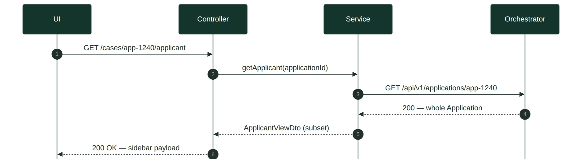
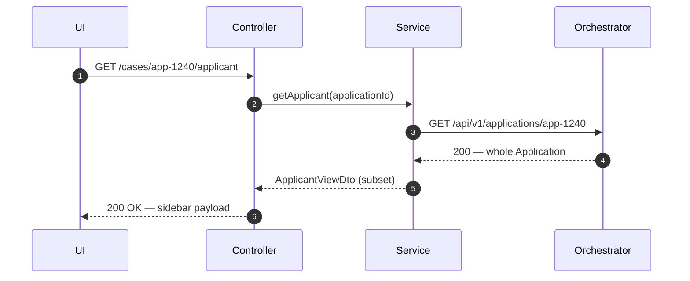
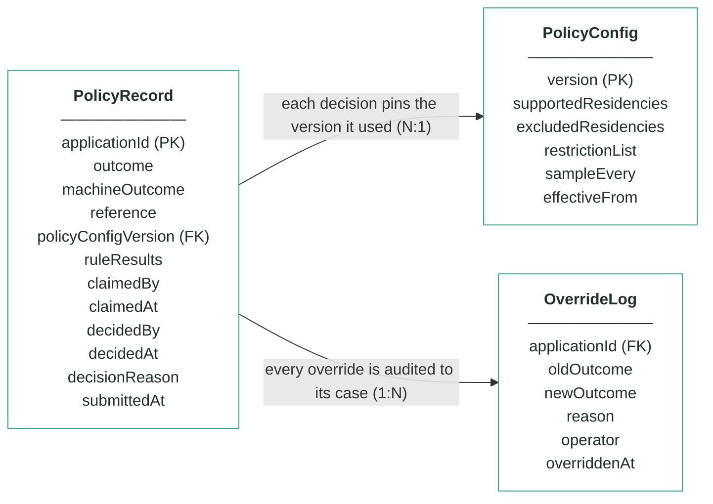
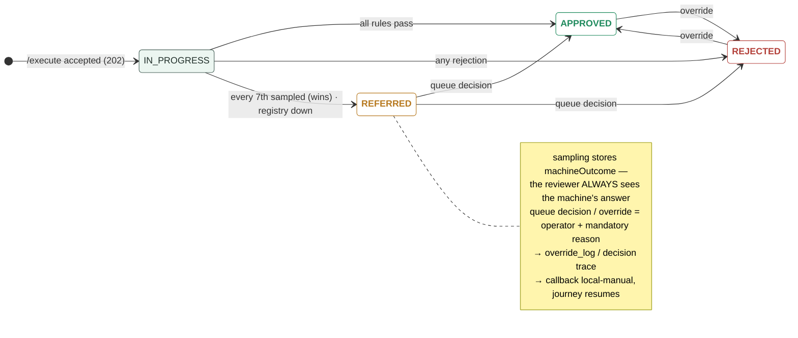

# Module 2 · Customer Policy — UC 03 · View Applicant

> AI implementation brief, generated from the v5 spec (`spec/.../use-cases/`). Source of truth is the spec; regenerate, don't hand-edit.

## Context

- Module: 2 · Customer Policy · category Rule · domain `policy` · command `check-policy` · outcomes: APPROVED, REFERRED, REJECTED
- Use case: 03 · View Applicant · track D · prerequisite: screen shell from 02 · build shape: API+FE · primary screen: Decision Detail sidebar
- Data effect: none — by design
- Platform rules (non-negotiable): the orchestrator is the only caller; the whole application arrives in the envelope (plus the v5 `outputs` block, Option A); steps are independent and re-orderable; the payload is NEVER stored — only `applicationId`; every module ships `GET /cases/{id}/applicant` proxying the orchestrator; big lists are empty by default and capped at 10 rows (≤10 hydration calls); ALL APIs are idempotent — same request twice, same result once; every endpoint appears in the service's OpenAPI 3.0 (Swagger) spec.

## Story

As a bank employee I want to see who a policy case is about without leaving the record — and without this module ever copying applicant data.

## Contract

```
GET /cases/{id}/applicant →  (proxy)
GET {orchestratorUrl}/api/v1/
        applications/{applicationId}
→ { …whole Application object… }
```

## Acceptance criteria

1. The Decision Detail sidebar renders fullName, dateOfBirth, taxResidencies, product.productCode, channel and countryOfResidence — fetched live.
2. For app-1240 the sidebar shows Sofia Ruiz with taxResidencies GB, US — the reviewer sees the exclusion's evidence right beside the rule card.  ⟵ **checkpoint — exact value**
3. Nothing from the response is persisted — restart the module, the sidebar still works, the schema still holds zero applicant columns.
4. Orchestrator unreachable → the sidebar shows a retryable error state; the case detail itself still renders from local data.
5. The proxy passes applicationId through untouched — no id mapping tables.

## Expected data changes

- **Zero writes, zero copies.** The whole point: one copy of the truth, owned by the orchestrator.
- MySQL is not even touched on this path.
- If the orchestrator is down the module stays healthy — only the sidebar degrades.

## Diagrams

> Rendered images first (for PDF/preview); the mermaid source is collapsed underneath for machine consumption.

### Sequence — this use case



<details><summary>mermaid source</summary>



</details>

### Entity model (suggested — the shape to beat)


**PolicyRecord — one row per applicationId (unique)**

| field | type | key | meaning |
|---|---|---|---|
| applicationId | string | PK | the journey key from the envelope — one row per application, and the ONLY applicant-related column |
| outcome | enum |  | the final answer: APPROVED, REFERRED or REJECTED — starts equal to machineOutcome; only a human decision changes it |
| machineOutcome | enum |  | what rules 1–3 computed before sampling — shown to the reviewer, never changed |
| reference | string |  | human-facing case reference shown on every screen, e.g. pol-000187 |
| policyConfigVersion | int | FK | the PolicyConfig version that decided this case — pinned forever, never re-pointed |
| ruleResults | JSON |  | embedded results of the four checks — existingProduct (with registryChecked), taxResidency (with matchedList), restrictionList, sampling (sampled + position) |
| claimedBy | string, nullable |  | referral queue — the operator who claimed the case |
| claimedAt | timestamp, nullable |  | referral queue — when it was claimed |
| decidedBy | string, nullable |  | who made the human decision (queue or override) — null means the machine's answer stands |
| decidedAt | timestamp, nullable |  | when the human decision was made |
| decisionReason | string, nullable |  | the mandatory reason recorded with every human decision |
| submittedAt | timestamp |  | when the orchestrator submitted the case |

**PolicyConfig — insert-only, versioned lists; the current version is the highest**

| field | type | key | meaning |
|---|---|---|---|
| version | int | PK | one new row per change — rows are inserted, never updated |
| supportedResidencies | string[] |  | rule 2 — at least one tax residency must be on this list, else REJECTED (seeded GB, IE, PL, DE, FR, ES, NL) |
| excludedResidencies | string[] |  | rule 2 — any residency on this list REJECTS, even beside a supported one (seeded US) |
| restrictionList | JSON |  | rule 3 — the bank's own blocked people as {fullName, dateOfBirth, reason} entries (seeded Victor Sable and Dana Kovacs) |
| sampleEvery | int |  | rule 4's X — every Xth first-time decision is REFERRED for human review (seeded 7) |
| effectiveFrom | timestamp |  | when this version became the current one |

**OverrideLog — audit trail; one row per manual override, none ever deleted**

| field | type | key | meaning |
|---|---|---|---|
| applicationId | string | FK | the case that was overridden |
| oldOutcome | enum |  | the outcome before the override |
| newOutcome | enum |  | the outcome after the override |
| reason | string |  | the mandatory justification typed by the operator |
| operator | string |  | who performed the override |
| overriddenAt | timestamp |  | when it happened |

Relationships: PolicyRecord N:1 PolicyConfig — each decision pins the version it used · PolicyRecord 1:N OverrideLog — every override is audited to its case

<details><summary>mermaid source (generated from the spec tables)</summary>



</details>

### State transitions — the case record


<details><summary>mermaid source</summary>



</details>

## Out of scope

Caching applicant data; storing any applicant field in this module's schema (forbidden by the contract). The customer-registry read (rule 1) is a different endpoint and a different use case.

## Build notes

THE standard application-fetch GET every module ships (v5 platform rule) — the same proxy hydrates the board's name column (UC 01) and the queue's rows (UC 04). It goes to the orchestrator only, server-side, so the browser needs no CORS exception.

## Tests

Service test with a mocked orchestrator client: happy path + orchestrator down → sidebar error, case still renders.

## Definition of done

All acceptance criteria verified against the running app · `./mvnw test` green · teammate-reviewed PR merged to main · fresh clone builds green · endpoint idempotent + present in the OpenAPI 3.0 (Swagger) spec · demoable from the UI.
