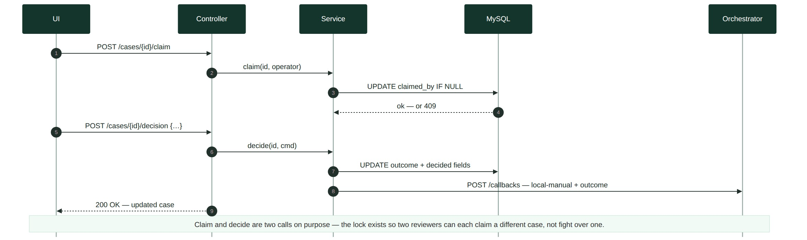
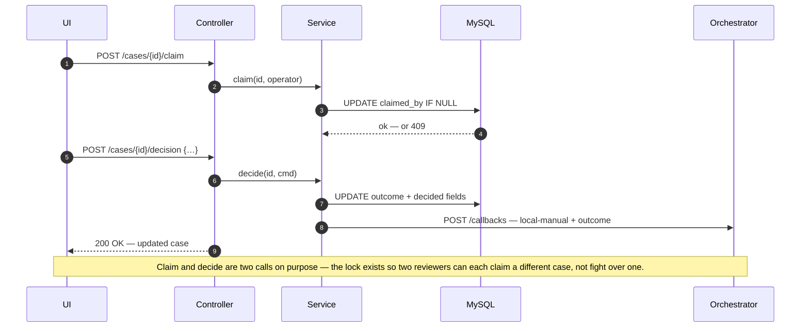
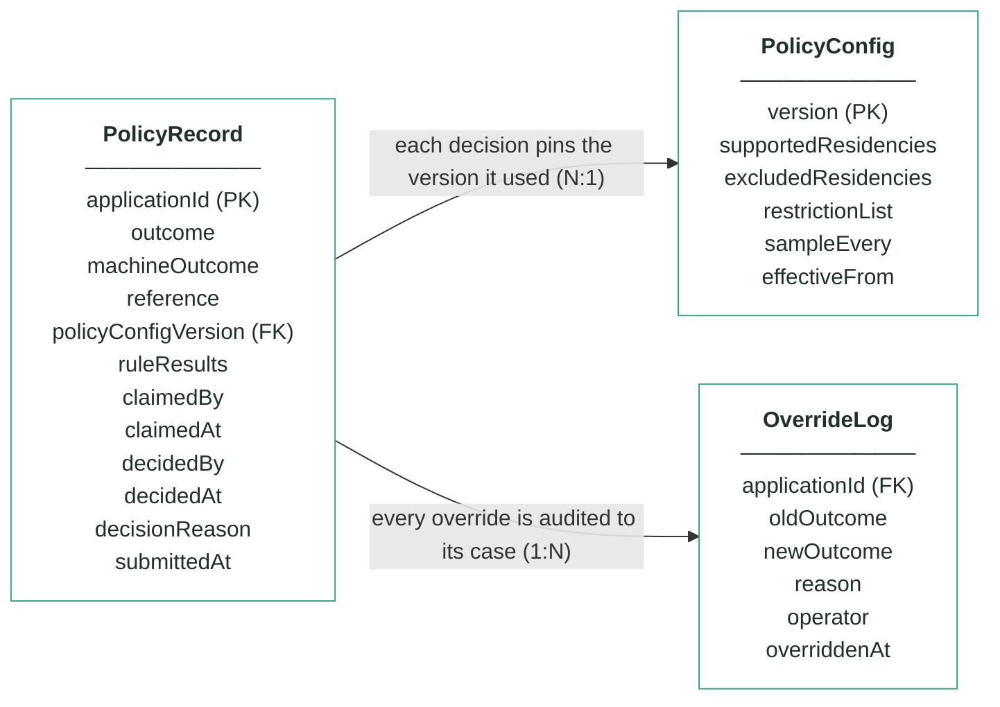
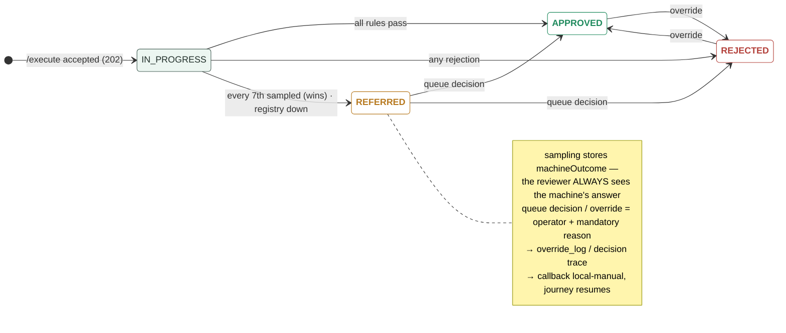

# Module 2 · Customer Policy — UC 04 · Work Referral Queue

> AI implementation brief, generated from the v5 spec (`spec/.../use-cases/`). Source of truth is the spec; regenerate, don't hand-edit.

## Context

- Module: 2 · Customer Policy · category Rule · domain `policy` · command `check-policy` · outcomes: APPROVED, REFERRED, REJECTED
- Use case: 04 · Work Referral Queue · track B · prerequisite: after 02 is wired · build shape: DB-write→API→FE · primary screen: Referral Queue
- Data effect: claim + decision writes + one callback
- Platform rules (non-negotiable): the orchestrator is the only caller; the whole application arrives in the envelope (plus the v5 `outputs` block, Option A); steps are independent and re-orderable; the payload is NEVER stored — only `applicationId`; every module ships `GET /cases/{id}/applicant` proxying the orchestrator; big lists are empty by default and capped at 10 rows (≤10 hydration calls); ALL APIs are idempotent — same request twice, same result once; every endpoint appears in the service's OpenAPI 3.0 (Swagger) spec.

## Story

As a policy operations analyst I want to claim a referred case, see exactly what the machine decided and why, and make the final call — so parked journeys resume with a human answer on record.

## Contract

```
POST /cases/{id}/claim   {"operator":"s.chen"}
POST /cases/{id}/release {"operator":"s.chen"}
POST /cases/{id}/decision
{"outcome":"APPROVED",
 "reason":"sampling QA — machine confirmed",
 "operator":"s.chen"}
→ 200 + updated case
```

## Acceptance criteria

1. The queue lists open REFERRED cases only, oldest first, max 10, each row showing its referral cause (sampled / registry / operator) and claim state.
2. POST /cases/{id}/claim → 200 and locks the case to that operator; a second claim by another operator → 409; release frees it.
3. The decision panel ALWAYS shows the machine's workings: machineOutcome plus all four rule cards — a reviewer can never decide without seeing what the machine concluded.
4. POST /cases/{id}/decision {outcome, reason, operator} → 200; outcome must be APPROVED or REJECTED; reason and operator are mandatory → 400 without either.
5. The decision fires ONE callback with status local-manual and POL_MANUAL_APPROVED or POL_MANUAL_DECLINED — the parked journey resumes.
6. Deciding the sampled case app-1287 as APPROVED records decidedBy, decidedAt and the reason; its machineOutcome APPROVED stays visible forever.  ⟵ **checkpoint — exact value**
7. At the fixture reference time 2026-07-15T09:00Z the queue holds exactly 3 open cases — 2 sampled, 1 registry-outage.  ⟵ **checkpoint — exact value**
8. A decided case leaves the queue and shows the human decision on top of the machine's answer in Decision Detail.

## Expected data changes

- **UPDATE policy_record** SET claimed_by/claimed_at on claim; outcome + decided_by/decided_at/decision_reason on decide.
- machineOutcome and ruleResults are NEVER touched — the machine's answer survives the human's.
- Callback status local-manual tells the orchestrator a human decided — the journey resumes.

## Diagrams

> Rendered images first (for PDF/preview); the mermaid source is collapsed underneath for machine consumption.

### Sequence — this use case



<details><summary>mermaid source</summary>



</details>

### Entity model (suggested — the shape to beat)


**PolicyRecord — one row per applicationId (unique)**

| field | type | key | meaning |
|---|---|---|---|
| applicationId | string | PK | the journey key from the envelope — one row per application, and the ONLY applicant-related column |
| outcome | enum |  | the final answer: APPROVED, REFERRED or REJECTED — starts equal to machineOutcome; only a human decision changes it |
| machineOutcome | enum |  | what rules 1–3 computed before sampling — shown to the reviewer, never changed |
| reference | string |  | human-facing case reference shown on every screen, e.g. pol-000187 |
| policyConfigVersion | int | FK | the PolicyConfig version that decided this case — pinned forever, never re-pointed |
| ruleResults | JSON |  | embedded results of the four checks — existingProduct (with registryChecked), taxResidency (with matchedList), restrictionList, sampling (sampled + position) |
| claimedBy | string, nullable |  | referral queue — the operator who claimed the case |
| claimedAt | timestamp, nullable |  | referral queue — when it was claimed |
| decidedBy | string, nullable |  | who made the human decision (queue or override) — null means the machine's answer stands |
| decidedAt | timestamp, nullable |  | when the human decision was made |
| decisionReason | string, nullable |  | the mandatory reason recorded with every human decision |
| submittedAt | timestamp |  | when the orchestrator submitted the case |

**PolicyConfig — insert-only, versioned lists; the current version is the highest**

| field | type | key | meaning |
|---|---|---|---|
| version | int | PK | one new row per change — rows are inserted, never updated |
| supportedResidencies | string[] |  | rule 2 — at least one tax residency must be on this list, else REJECTED (seeded GB, IE, PL, DE, FR, ES, NL) |
| excludedResidencies | string[] |  | rule 2 — any residency on this list REJECTS, even beside a supported one (seeded US) |
| restrictionList | JSON |  | rule 3 — the bank's own blocked people as {fullName, dateOfBirth, reason} entries (seeded Victor Sable and Dana Kovacs) |
| sampleEvery | int |  | rule 4's X — every Xth first-time decision is REFERRED for human review (seeded 7) |
| effectiveFrom | timestamp |  | when this version became the current one |

**OverrideLog — audit trail; one row per manual override, none ever deleted**

| field | type | key | meaning |
|---|---|---|---|
| applicationId | string | FK | the case that was overridden |
| oldOutcome | enum |  | the outcome before the override |
| newOutcome | enum |  | the outcome after the override |
| reason | string |  | the mandatory justification typed by the operator |
| operator | string |  | who performed the override |
| overriddenAt | timestamp |  | when it happened |

Relationships: PolicyRecord N:1 PolicyConfig — each decision pins the version it used · PolicyRecord 1:N OverrideLog — every override is audited to its case

<details><summary>mermaid source (generated from the spec tables)</summary>



</details>

### State transitions — the case record


<details><summary>mermaid source</summary>



</details>

## Out of scope

Deciding non-REFERRED cases from here (that is UC 06 Override); claim timeouts and SLA clocks (stretch, not locked).

## Build notes

Queue = GET /cases?outcome=REFERRED&unclaimed-first, oldest first, max 10. Claim sets claimedBy/claimedAt and returns 409 if already claimed by someone else — the two-reviewer race is the test worth writing. The decision panel renders machineOutcome + all four rule cards read-only; the human NEVER decides blind. Decision → outcome APPROVED or REJECTED, callback local-manual with POL_MANUAL_APPROVED / POL_MANUAL_DECLINED.

## Tests

Slice test: claim happy path, double-claim → 409, decide without reason → 400; service test asserts exactly one local-manual callback per decision.

## Sequence caption

Claim and decide are two calls on purpose — the lock exists so two reviewers can each claim a different case, not fight over one.

## Definition of done

All acceptance criteria verified against the running app · `./mvnw test` green · teammate-reviewed PR merged to main · fresh clone builds green · endpoint idempotent + present in the OpenAPI 3.0 (Swagger) spec · demoable from the UI.
