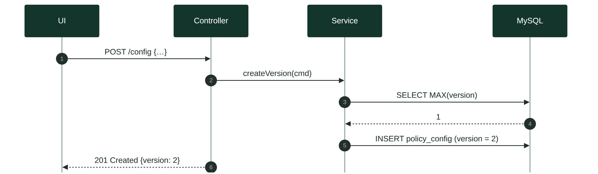
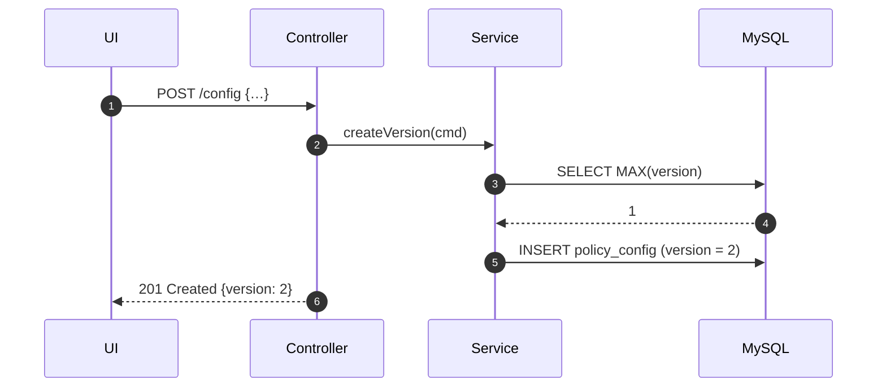
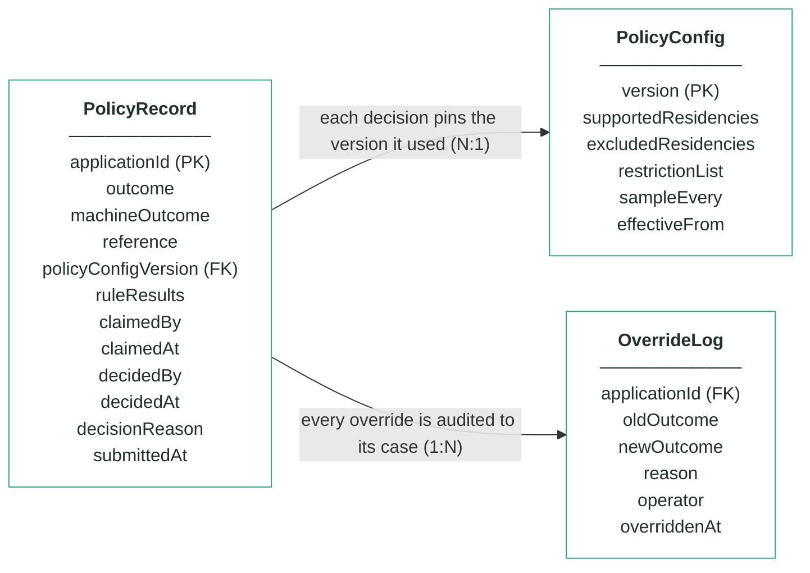
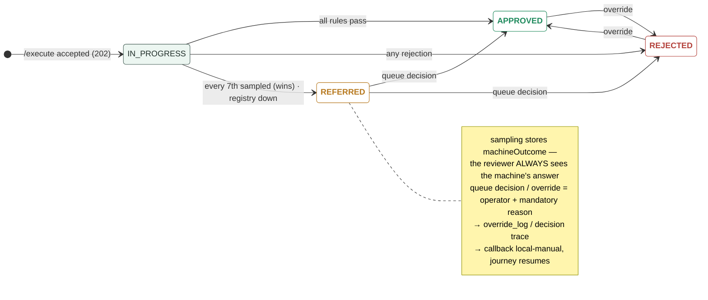
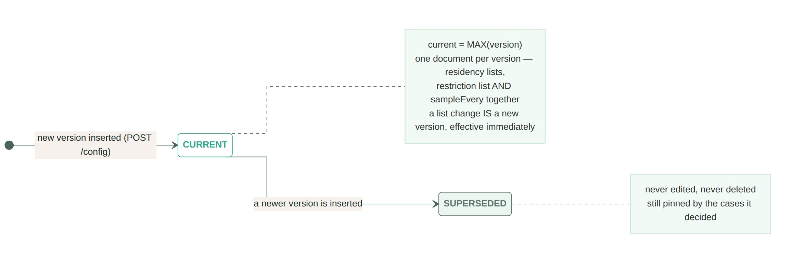
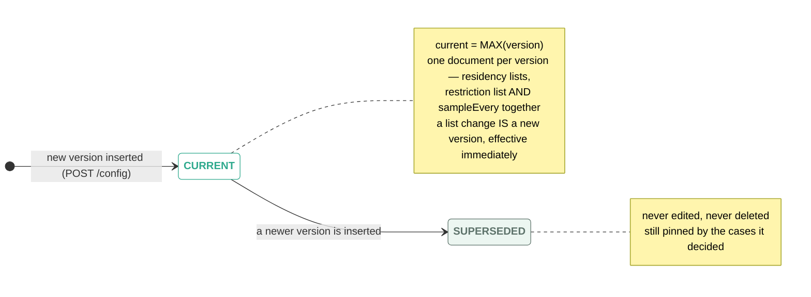

# Module 2 · Customer Policy — UC 07 · Edit Policy Config

> AI implementation brief, generated from the v5 spec (`spec/.../use-cases/`). Source of truth is the spec; regenerate, don't hand-edit.

## Context

- Module: 2 · Customer Policy · category Rule · domain `policy` · command `check-policy` · outcomes: APPROVED, REFERRED, REJECTED
- Use case: 07 · Edit Policy Config · track C · prerequisite: none (independent) · build shape: DB-write→API→FE · primary screen: Policy Configuration
- Data effect: insert-only
- Platform rules (non-negotiable): the orchestrator is the only caller; the whole application arrives in the envelope (plus the v5 `outputs` block, Option A); steps are independent and re-orderable; the payload is NEVER stored — only `applicationId`; every module ships `GET /cases/{id}/applicant` proxying the orchestrator; big lists are empty by default and capped at 10 rows (≤10 hydration calls); ALL APIs are idempotent — same request twice, same result once; every endpoint appears in the service's OpenAPI 3.0 (Swagger) spec.

## Story

As a compliance officer I want to change the residency lists, the restriction list or the sampling rate without a deploy — policy ships as data.

## Contract

```
POST /config
{"supportedResidencies":["GB","IE","PL","DE",
   "FR","ES","NL"],
 "excludedResidencies":["US"],
 "restrictionList":[{"fullName":"Victor Sable",
   "dateOfBirth":"1978-03-02",
   "reason":"prior fraud loss"}],
 "sampleEvery":7}
→ 201 + {version: 2}
```

## Acceptance criteria

1. POST /config with the full document → 201; a NEW version row is inserted — never an update.
2. Version numbers increment from the seeded v1.
3. Seed data: v1 exists on first boot — supported GB, IE, PL, DE, FR, ES, NL · excluded US · 2 restriction entries · sampleEvery 7.  ⟵ **checkpoint — exact value**
4. Invalid payload (country on both lists, restriction entry without a reason, sampleEvery < 1) → 400 with field-level errors.
5. The next /execute decides with the new version; cases decided earlier still show the version they used.
6. Adding a restriction entry makes the very next matching application REJECT with POL_CUSTOMER_BLOCKED — demo-able live.
7. Changing sampleEvery from 7 to 3 changes how often rule 4 fires from the next decision on — no restart, no redeploy.

## Expected data changes

- **INSERT policy_config** row with version = MAX + 1 — the whole document, lists and sampleEvery together.
- **Never UPDATE, never DELETE** — history is the audit trail.
- Existing policy_record rows are untouched — their pinned policyConfigVersion keeps old decisions explainable.

## Diagrams

> Rendered images first (for PDF/preview); the mermaid source is collapsed underneath for machine consumption.

### Sequence — this use case



<details><summary>mermaid source</summary>



</details>

### Entity model (suggested — the shape to beat)


**PolicyRecord — one row per applicationId (unique)**

| field | type | key | meaning |
|---|---|---|---|
| applicationId | string | PK | the journey key from the envelope — one row per application, and the ONLY applicant-related column |
| outcome | enum |  | the final answer: APPROVED, REFERRED or REJECTED — starts equal to machineOutcome; only a human decision changes it |
| machineOutcome | enum |  | what rules 1–3 computed before sampling — shown to the reviewer, never changed |
| reference | string |  | human-facing case reference shown on every screen, e.g. pol-000187 |
| policyConfigVersion | int | FK | the PolicyConfig version that decided this case — pinned forever, never re-pointed |
| ruleResults | JSON |  | embedded results of the four checks — existingProduct (with registryChecked), taxResidency (with matchedList), restrictionList, sampling (sampled + position) |
| claimedBy | string, nullable |  | referral queue — the operator who claimed the case |
| claimedAt | timestamp, nullable |  | referral queue — when it was claimed |
| decidedBy | string, nullable |  | who made the human decision (queue or override) — null means the machine's answer stands |
| decidedAt | timestamp, nullable |  | when the human decision was made |
| decisionReason | string, nullable |  | the mandatory reason recorded with every human decision |
| submittedAt | timestamp |  | when the orchestrator submitted the case |

**PolicyConfig — insert-only, versioned lists; the current version is the highest**

| field | type | key | meaning |
|---|---|---|---|
| version | int | PK | one new row per change — rows are inserted, never updated |
| supportedResidencies | string[] |  | rule 2 — at least one tax residency must be on this list, else REJECTED (seeded GB, IE, PL, DE, FR, ES, NL) |
| excludedResidencies | string[] |  | rule 2 — any residency on this list REJECTS, even beside a supported one (seeded US) |
| restrictionList | JSON |  | rule 3 — the bank's own blocked people as {fullName, dateOfBirth, reason} entries (seeded Victor Sable and Dana Kovacs) |
| sampleEvery | int |  | rule 4's X — every Xth first-time decision is REFERRED for human review (seeded 7) |
| effectiveFrom | timestamp |  | when this version became the current one |

**OverrideLog — audit trail; one row per manual override, none ever deleted**

| field | type | key | meaning |
|---|---|---|---|
| applicationId | string | FK | the case that was overridden |
| oldOutcome | enum |  | the outcome before the override |
| newOutcome | enum |  | the outcome after the override |
| reason | string |  | the mandatory justification typed by the operator |
| operator | string |  | who performed the override |
| overriddenAt | timestamp |  | when it happened |

Relationships: PolicyRecord N:1 PolicyConfig — each decision pins the version it used · PolicyRecord 1:N OverrideLog — every override is audited to its case

<details><summary>mermaid source (generated from the spec tables)</summary>



</details>

### State transitions — the case record


<details><summary>mermaid source</summary>



</details>

### State transitions — the versioned configuration



<details><summary>mermaid source</summary>



</details>

## Out of scope

Deleting or editing an existing version (insert-only); per-product policy lists; a DRAFT/approval workflow.

## Build notes

current = MAX(version) — no is_current flag to keep in sync. A version is the WHOLE config document: both residency lists, the full restriction list, sampleEvery. Validation: lists are ISO alpha-2 uppercase, no country on both lists, every restriction entry carries fullName + dateOfBirth + non-blank reason, sampleEvery ≥ 1.

## Tests

Repository test: version increments; validation 400s (country on both lists, blank reason); engine picks up the new current version on the next /execute.

## Definition of done

All acceptance criteria verified against the running app · `./mvnw test` green · teammate-reviewed PR merged to main · fresh clone builds green · endpoint idempotent + present in the OpenAPI 3.0 (Swagger) spec · demoable from the UI.
