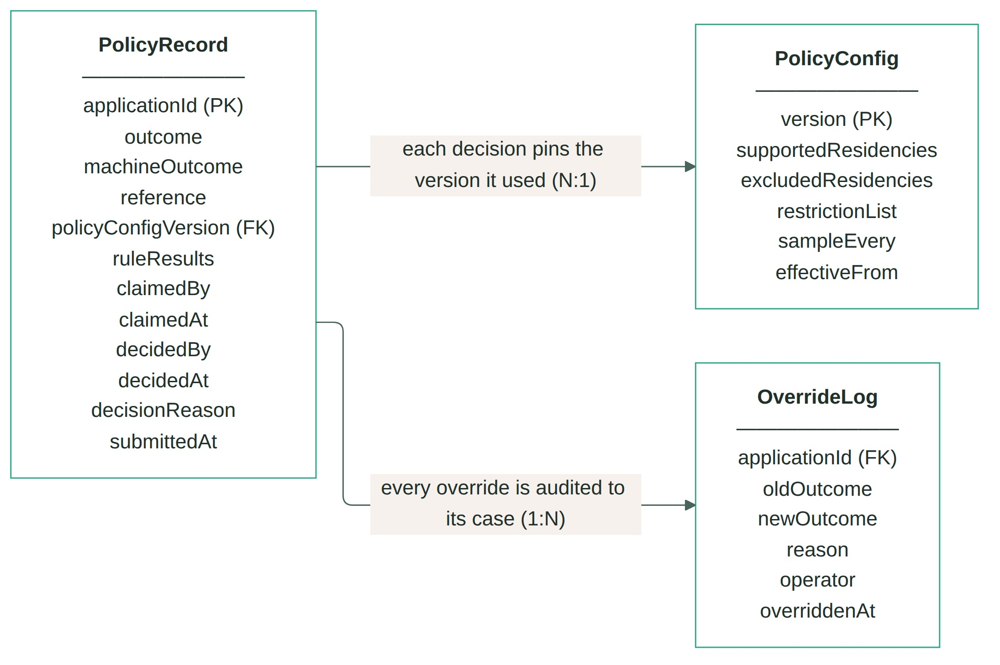
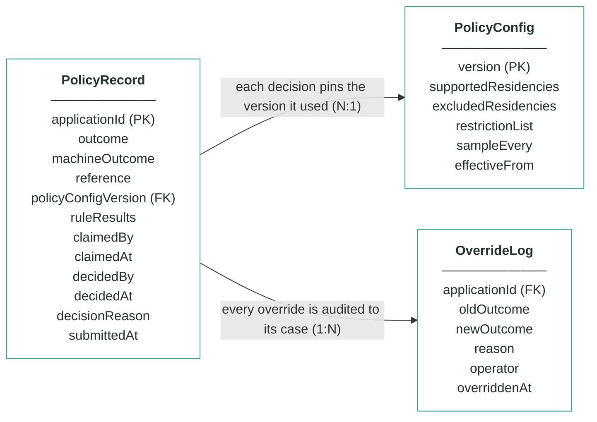
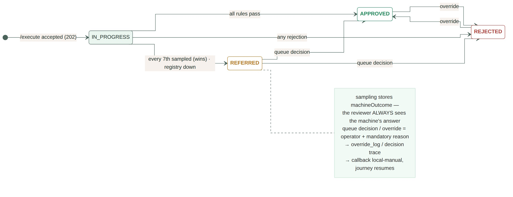
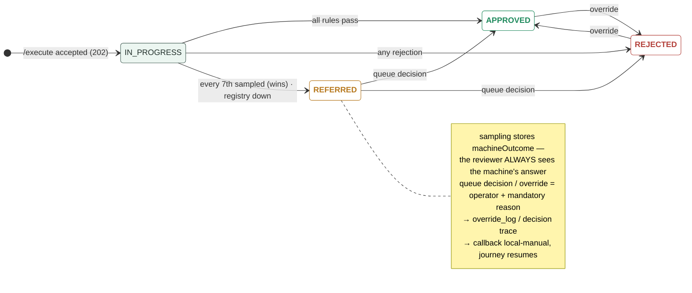

# Module 2 · Customer Policy — UC 09 · Minimum relationship tenure (CANDIDATE)

> AI implementation brief, generated from the v5 spec (`spec/.../use-cases/`). Source of truth is the spec; regenerate, don't hand-edit.

## Context

- Module: 2 · Customer Policy · category Rule · domain `policy` · command `check-policy` · outcomes: APPROVED, REFERRED, REJECTED
- Use case: 09 · Minimum relationship tenure · track B · prerequisite: after 01–08 · build shape: rule engine ext. · primary screen: Decision Detail (rule 5)
- Data effect: config field + engine branch
- Platform rules (non-negotiable): the orchestrator is the only caller; the whole application arrives in the envelope (plus the v5 `outputs` block, Option A); steps are independent and re-orderable; the payload is NEVER stored — only `applicationId`; every module ships `GET /cases/{id}/applicant` proxying the orchestrator; big lists are empty by default and capped at 10 rows (≤10 hydration calls); ALL APIs are idempotent — same request twice, same result once; every endpoint appears in the service's OpenAPI 3.0 (Swagger) spec.

## Story

A customer closes their card and reapplies the same week — often chasing a sign-up bonus. Real banks impose a cooling period: a returning customer whose previous product closed less than N months ago is referred to a person instead of sailing through. The registry already knows; the rule just has to ask.

## What it adds

- PolicyConfig gains `minTenureMonths` (nullable — null means no cooling period).
- The engine gains rule 5: a registry match with a CLOSED product whose closedAt is less than minTenureMonths ago → REFERRED; ruleResults gains a 5th section when the config carries the field.
- New reason code `POL_TENURE_TOO_SHORT` — a v5 contract addition, instructor applies it.
- No new entity and no new endpoint — the existing registry read already returns closedAt per product.

## Acceptance criteria

1. An applicant with a CLOSED product closed 2 months ago, minTenureMonths 6 → REFERRED with POL_TENURE_TOO_SHORT; the case lands in the referral queue like any other REFERRED.
2. The same applicant with the product closed 8 months ago passes rule 5.
3. An applicant with an ACTIVE product is still REJECTED by rule 1 — tenure never rescues a live holding.
4. minTenureMonths = null leaves the engine exactly as before — all eight UC 01–08 ACs still pass unchanged.
5. The threshold is versioned config: a new PolicyConfig version can add, change or drop it without a deploy, and old cases keep their pinned version.

## Diagrams

> Rendered images first (for PDF/preview); the mermaid source is collapsed underneath for machine consumption.

### Entity model (suggested — the shape to beat)

**PolicyRecord — one row per applicationId (unique)**

| field | type | key | meaning |
|---|---|---|---|
| applicationId | string | PK | the journey key from the envelope — one row per application, and the ONLY applicant-related column |
| outcome | enum |  | the final answer: APPROVED, REFERRED or REJECTED — starts equal to machineOutcome; only a human decision changes it |
| machineOutcome | enum |  | what rules 1–3 computed before sampling — shown to the reviewer, never changed |
| reference | string |  | human-facing case reference shown on every screen, e.g. pol-000187 |
| policyConfigVersion | int | FK | the PolicyConfig version that decided this case — pinned forever, never re-pointed |
| ruleResults | JSON |  | embedded results of the four checks — existingProduct (with registryChecked), taxResidency (with matchedList), restrictionList, sampling (sampled + position) |
| claimedBy | string, nullable |  | referral queue — the operator who claimed the case |
| claimedAt | timestamp, nullable |  | referral queue — when it was claimed |
| decidedBy | string, nullable |  | who made the human decision (queue or override) — null means the machine's answer stands |
| decidedAt | timestamp, nullable |  | when the human decision was made |
| decisionReason | string, nullable |  | the mandatory reason recorded with every human decision |
| submittedAt | timestamp |  | when the orchestrator submitted the case |

**PolicyConfig — insert-only, versioned lists; the current version is the highest**

| field | type | key | meaning |
|---|---|---|---|
| version | int | PK | one new row per change — rows are inserted, never updated |
| supportedResidencies | string[] |  | rule 2 — at least one tax residency must be on this list, else REJECTED (seeded GB, IE, PL, DE, FR, ES, NL) |
| excludedResidencies | string[] |  | rule 2 — any residency on this list REJECTS, even beside a supported one (seeded US) |
| restrictionList | JSON |  | rule 3 — the bank's own blocked people as {fullName, dateOfBirth, reason} entries (seeded Victor Sable and Dana Kovacs) |
| sampleEvery | int |  | rule 4's X — every Xth first-time decision is REFERRED for human review (seeded 7) |
| effectiveFrom | timestamp |  | when this version became the current one |

**OverrideLog — audit trail; one row per manual override, none ever deleted**

| field | type | key | meaning |
|---|---|---|---|
| applicationId | string | FK | the case that was overridden |
| oldOutcome | enum |  | the outcome before the override |
| newOutcome | enum |  | the outcome after the override |
| reason | string |  | the mandatory justification typed by the operator |
| operator | string |  | who performed the override |
| overriddenAt | timestamp |  | when it happened |

Relationships: PolicyRecord N:1 PolicyConfig — each decision pins the version it used · PolicyRecord 1:N OverrideLog — every override is audited to its case

mermaid source (generated from the spec tables)

### State transitions — the case record

mermaid source

## Why this one

Cheapest candidate on the module's list: no new entity, no new mock, no new registry field — one config column + one engine branch over data rule 1 already fetches. And it demos well: close James's card in the registry stub, reapply, watch him park instead of pass.

## Definition of done

All acceptance criteria verified against the running app · `./mvnw test` green · teammate-reviewed PR merged to main · fresh clone builds green · endpoint idempotent + present in the OpenAPI 3.0 (Swagger) spec · demoable from the UI.
